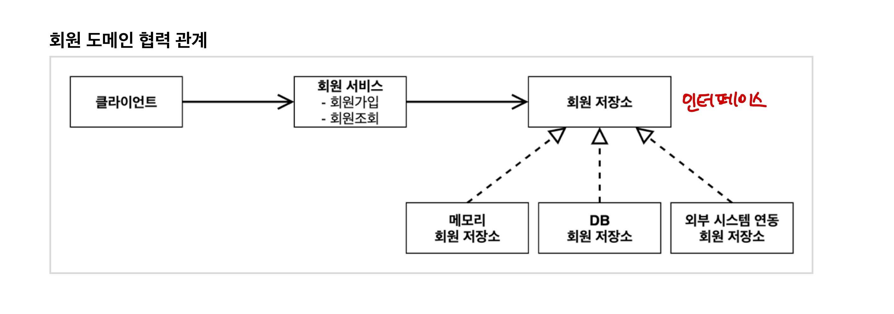
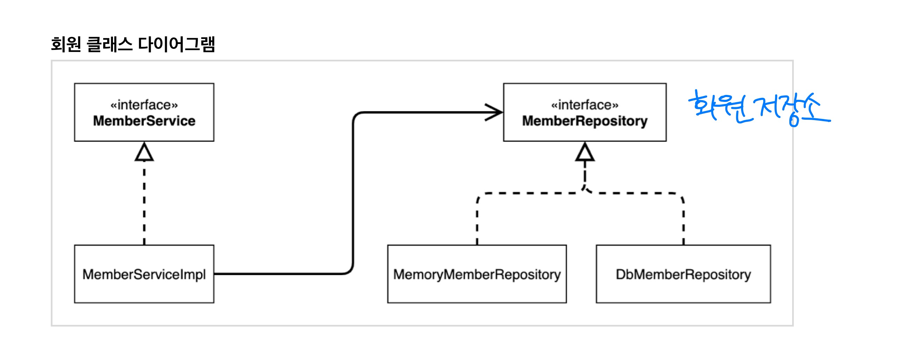
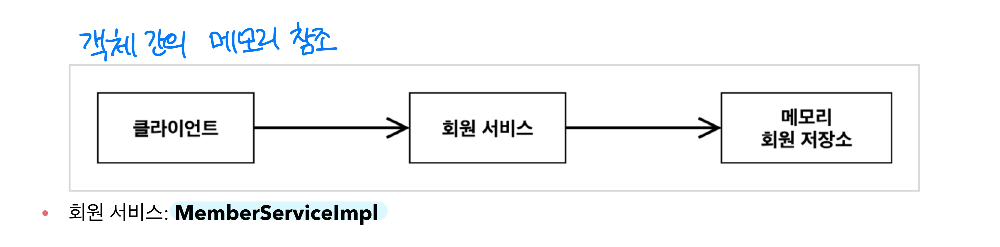

# [2] 스프링 핵심 원리 - 이해1 예제 만들기

### 학습 목표

1. 비즈니스 요구사항을 파악하고, 회원 / 주문 / 할인 도메인을 설계하고 개발할 수 있다.
2. 개발한 도메인을 실행하고 테스트할 수 있다.


## 1. 비즈니스 요구사항과 설계

- 회원
  - 회원을 가입하고 조회할 수 있다
  - 회원은 일반과 VIP 두 가지 등급으로 나뉜다
  - 회원 데이터는 자체 DB를 구축할 수 있고, 외부 시스템과 연동할 수 있다 (미확정)
- 주문과 할인 정책
  - 회원은 상품을 주문할 수 있다
  - 회원 등급에 따라 할인 정책을 적용할 수 있다
  - 할인 정책은 모든 VIP는 1000원을 할인해주는 고정 금액 할인을 적용해달라는 요청이 있다 (나중에 변경 가능성 농후)
  - 할인 정책은 변경 가능성이 높다. 회사의 기본 할인 정책을 아직 정하지 못했다. 오픈 직전까지 고민을 미루고 싶다.
- 요구 사항을 보면 회원 데이터, 할인 정책과 같은 부분은 지금 결정하기 너무 어렵다. 그러나 기획만을 기다리고 개발을 무기한 연기할 수는 없다. 어떻게 해야할까? --> 역할과 구현을 나누면 되지 않을까?!
  - **인터페이스를 만들고, 구현체를 갈아끼울 수 있도록 설계하면 된다 !**








## 2. 회원 도메인 설계 및 개발

### 회원 도메인 설계의 문제점

- **다른 저장소로 변경할 때 OCP 원칙을 잘 지키고 있는가?**

- **DIP를 잘 지키고 있는가?**

- 의존 관계가 인터페이스 뿐만 아니라 구현까지 모두 의존하는 문제점이 있다

  ```java
  public class MemberServiceImpl implements MemberService {
  		private final MemberRepository memberRepository = new MemoryMemberRepository();
  }
  ```

  -  `MemberServiceImpl` 은  인터페이스(추상화)에도 의존하고, 구현에도 의존하고 있다.


## 3. 주문과 할인 도메인 설계 및 개발

#### 주문과 할인 정책

- 회원은 상품을 주문할 수 있다.
- 회원 등급에 따라 할인 정책을 적용할 수 있다.
- 할인 정책은 모든 VIP는 1000원을 할인해주는 고정 금액 할인을 적용해 달라 (나중에 변경 가능성)
- 할인 정책은 변경 가능성이 높다. 회사의 기본 할인 정책을 아직 정하지 못했고, 오픈 직전까지 고민을 미루고 싶다. 최악의 경우에는 할인을 적용하지 않을 수 있다 (미확정된 사항)


1. 주문 생성 : 클라이언트는 주문 서비스에 주문 생성을 요청한다
2. 회원 조회 : 할인을 위해서는 회원 등급이 필요하다. 그래서 주문 서비스는 회원 저장소에서 회원을 조회한다.
3. 할인 적용 : 주문 서비스는 회원 등급에 따른 할인 여부를 할인 정책에 위임한다.
4. 주문 결과 반환 : 주문 서비스는 할인 결과를 포함한 주문 결과를 반환한다.

- 회원을 메모리에서 조회하고, 정액 할인 정책을 지원해도 주문 서비스를 변경하지 않아도 된다.
- 역할들의 협력 관계를 그대로 재사용할 수 있다.


- 주문 생성 요청이 오면, 회원 정보를 조회하고, 할인 정책을 적용한 다음 주문 객체를 생성하여 반환한다

 ```java
 public class OrderServiceImpl implements OrderService {
 
     private final MemberRepository memberRepository = new MemoryMemberRepository();
     private final DiscountPolicy discountPolicy = new FixDiscountPolicy();
 
     @Override
     public Order createOrder(Long memberId, String itemName, int itemPrice) {
         Member member = memberRepository.findById(memberId); // 회원 조회
         int discountPrice = discountPolicy.discount(member, itemPrice);
 
         return new Order(memberId, itemName, itemPrice, discountPrice);
     }
 }
 ```


## 출처 

[인프런 - 스프링 핵심원리 - 기본편](https://www.inflearn.com/course/%EC%8A%A4%ED%94%84%EB%A7%81-%ED%95%B5%EC%8B%AC-%EC%9B%90%EB%A6%AC-%EA%B8%B0%EB%B3%B8%ED%8E%B8)
