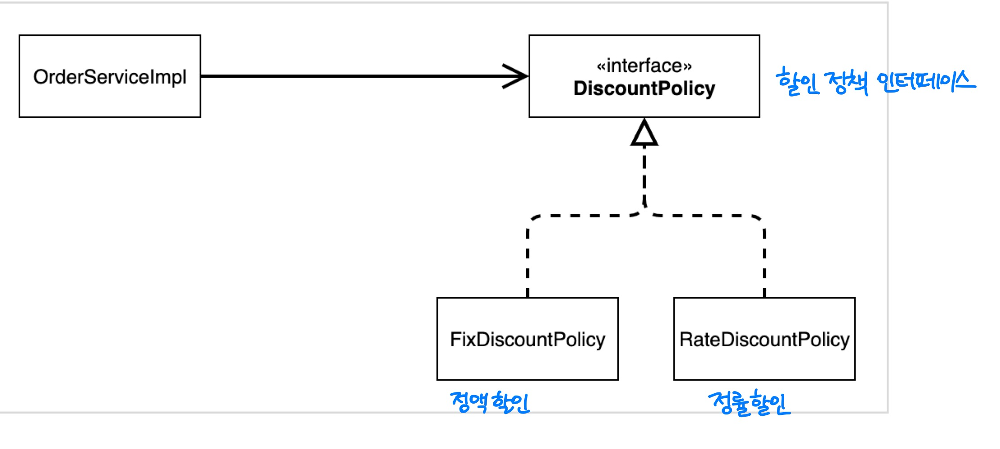
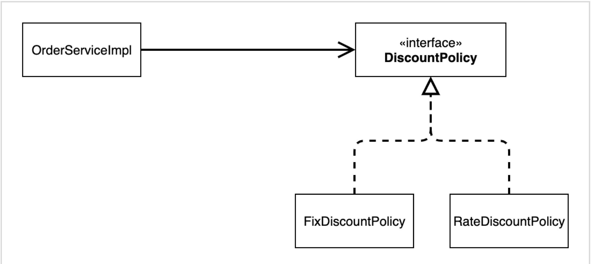
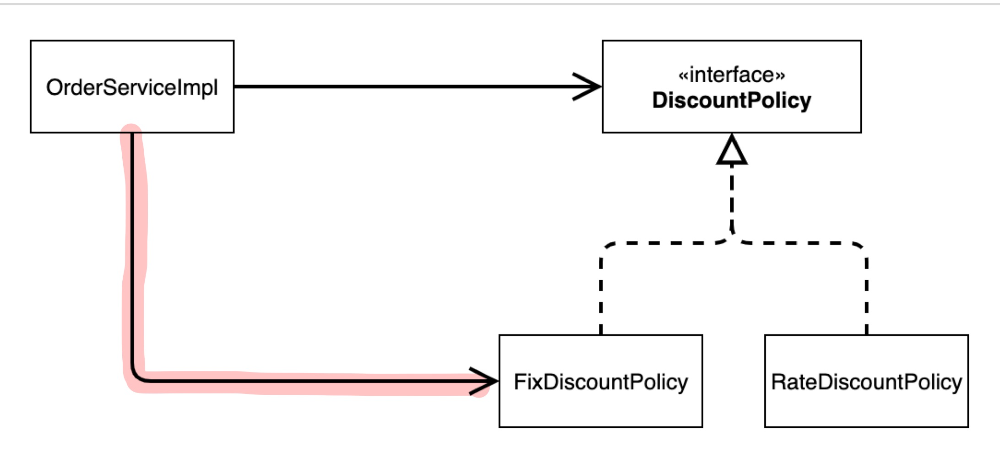
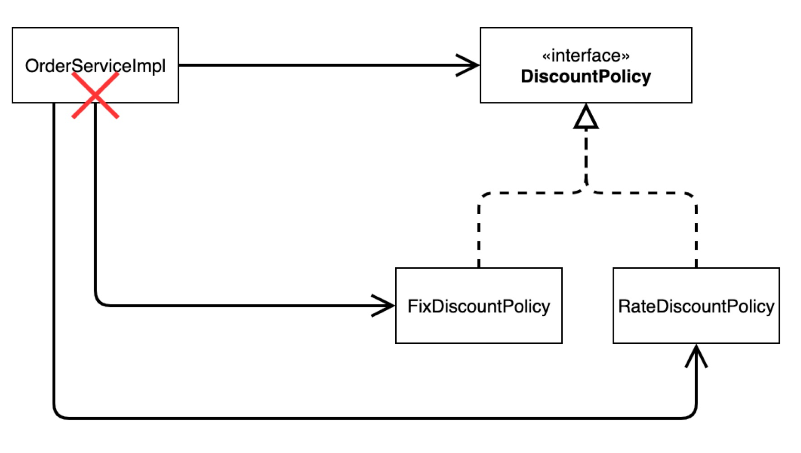
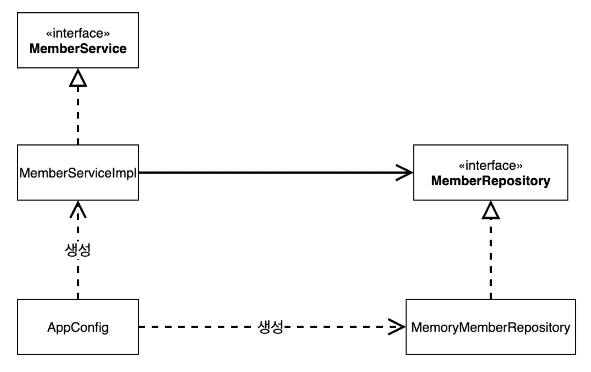
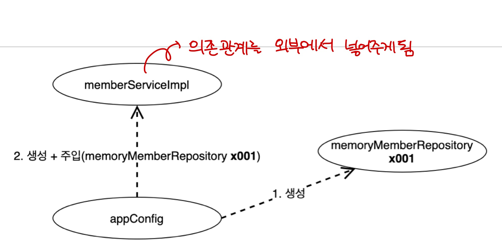
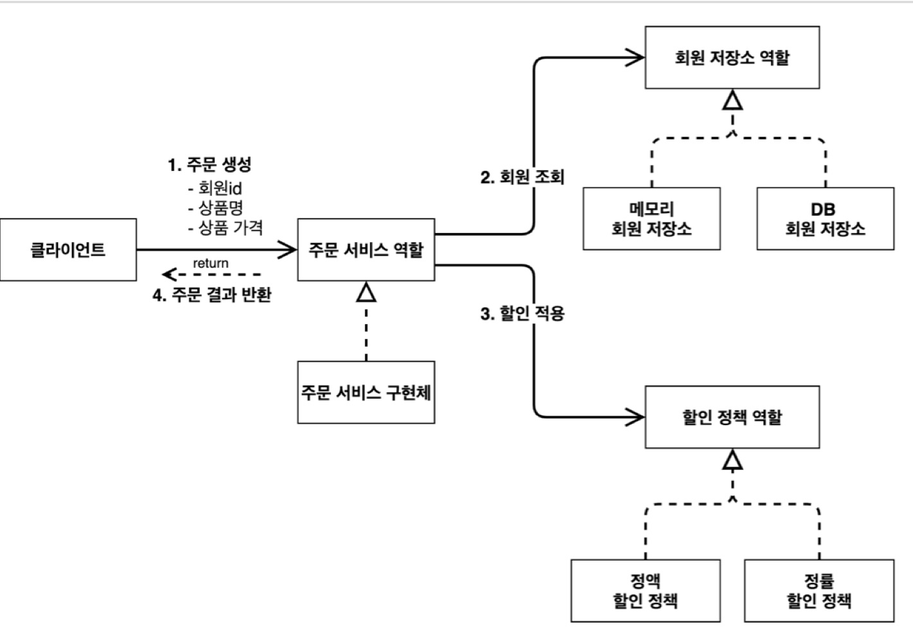
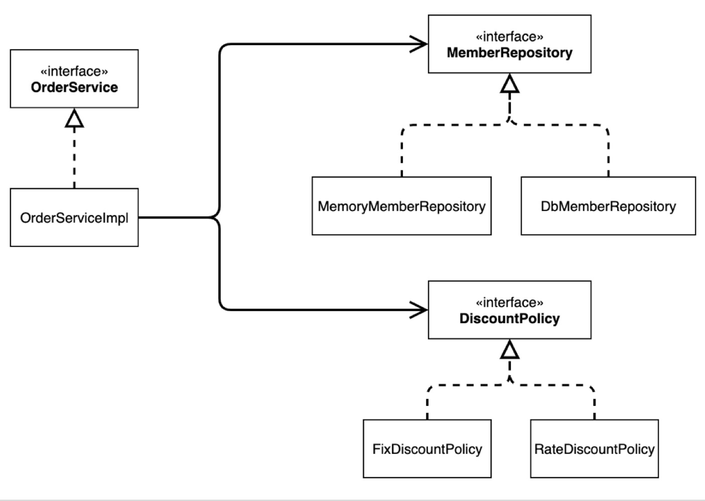
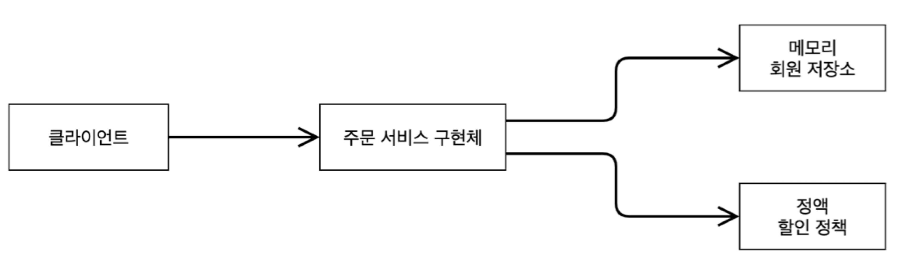

# [3] 스프링 핵심 원리 - 이해2 객체 지향 원리 적용

### 학습 목표

1. 새로운 요구사항에 대해 개발하고 이를 개발하는 데에 있어서 발생하는 문제점을 알 수 있다.
2. 관심사를 분리해볼 수 있다.


이전에 개발했던 코드가 정말 객체 지향 설계 원칙을 잘 준수했는지 확인해보자. 이번에는 주문한 금액의 %를 할인해주는 새로운 정률 할인 정책을 추가한다.

## 1. 할인 정책을 애플리케이션에 적용하기



- **할인 정책을 실제적으로 적용하려면, 클라이언트인 `OrderServiceImpl` 을 고쳐야 한다**

```java
public class OrderServiceImpl implements OrderService {

    private final MemberRepository memberRepository = new MemoryMemberRepository();
//    private final DiscountPolicy discountPolicy = new FixDiscountPolicy();
    private final DiscountPolicy discountPolicy = new RateDiscountPolicy();
}
```


## 2. 문제점 발견

- 역할과 구현을 충실하게 분리했는가? -> O
- 다형성도 활용하고, 인터페이스와 구현 객체를 분리했는가? -> O
- OCP, DIP 와 같은 객체 지향 설계 원칙을 충실히 준수했는가?
  - 그렇게 보이지만 사실은 아니다

> 1. OCP (Open / Closed Principle) : 개방 - 폐쇄 원칙
>
> - 소프트웨어 요소는 확장에는 열려 있으나 변경에는 닫혀 있어야 한다
>
> 2. DIP (Dependeny Inversion Principle) : 의존 관계 역전 원칙
>
> - "추상화에 의존해야지, 구체화에 의존하면 안된다."
> - 클라이언트 코드가 **구현 클래스에 의존하지 말고, 인터페이스에 의존하라**

- DIP : 주문 서비스 클라이언트 (`OrderServiceImpl`) 은 `DiscountPolicy` 인터페이스에 의존하면서 DIP를 지킨 것 같은데??
  - 추상화(인터페이스) 뿐만 아니라 구체화(구현) 클래스에도 의존하고 있는 것을 확인할 수 있다
    - 추상화 의존 (인터페이스 의존) : `DiscountPolicy`
    - 구체화 의존 (구현 클래스 의존) : `FixDiscountPolicy` , `RateDiscountPolicy`
  - DIP를 위반하고 있다


#### 기대했던 의존 관계



- `DiscountPolicy` 인터페이스만 의존한다고 생각했지만, 사실은

#### 실제 의존 관계



- `FixDiscountPolicy` 인 구체 클래스도 함께 의존하고 있다. => 📌 **DIP를 위반!!**


#### 만약, 정책을 변경하면



- 정책을 `RateDiscountPolicy`로 변경하는 순간 `OrderServiceImpl` 의 코드를 함께 변경해야 한다 => 📌 **OCP를 위반**


- OCP : 변경하지 않고 확장할 수 있다고 했는데???
  - `OrderServiceImpl` 은 기능을 확장해서 변경하면 클라이언트 코드에 영향을 준다
  - 따라서 기능을 확장하여 변경하는 순간 OCP를 위반한다고 할 수 있다


#### 결론

- 클라이언트 코드인 `OrderServiceImpl` 은 `DiscountPolicy` 의 인터페이스 뿐만 아니라 구체 클래스도 함께 의존한다 --> **DIP 위반**
- **구체 클래스를 변경할 때, 클라이언트 코드도 함께 변경해야 한다**


###  그러면 어떻게 해결해야 하는가?

- DIP 위반하니까
  - **추상에만 의존하도록 (인터페이스에만 의존하도록)** 변경해야 한다

#### 인터페이스에만 의존하도록 설계를 변경하자


```java
public class OrderServiceImpl implements OrderService {

    private final MemberRepository memberRepository = new MemoryMemberRepository();

    private DiscountPolicy discountPolicy; // 인터페이스에만 의존하도록 코드를 변경한다

}
```

🤔 구현체가 없는데 어떻게 코드를 실행할 수 있을까??

- 실제 실행을 해보면 `NullPointerException` 이 발생한다

### 🧐 해결방안
- 결국 **누군가**가 클라이언트인 `OrderServiceImpl` 에 `DiscountPolicy` 의 **구현 객체를 대신 생성하고 주입해주어야 한다**


## 3. 관심사의 분리
- 이전까지는 구현체를 생성하고 선택하는 등 다양한 책임을 가지고 있었다.
- 공연 기획자를 만들고, 배우와 공연 기획자의 책임을 확실히 분리하자
- **관심사를 분리하자**


### AppConfig의 등장
- 애플리케이션의 전체 동작 방식을 구성(config)하기  위해, **구현 객체를 생성**하고, 연결하는 **책임**을 가지는 별도의 설정 클래스를 만들자

- `AppConfig.java`

  ```java
  public class AppConfig {
  		public MemberService memberService() {
  				return new MemberServiceImpl(new MemoryMemberRepository());
  		}
  }
  ```

- `MemberServiceImpl`

  ```java
  public class MemberServiceImpl implements MemberService {

      private final MemberRepository memberRepository;

      // 생성자를 통해 memberRepository의 구현체를 지정한다
      public MemberServiceImpl(MemberRepository memberRepository) {
          this.memberRepository = memberRepository;
      }
  }
  ```

  - 이제 생성자를 통해 `memberRepository` 의 구현체를 지정하므로, `MemberServiceImpl` 은 구체화를 전혀 모른다
    - 생성자를 통해 객체가 들어간다 => 생성자 주입

- 동일하게 `OrderServiceImpl` 도 바꾸면,

- `AppConfig.java`

  ```java
  public class AppConfig {
      public MemberService memberService() {
          return new MemberServiceImpl(new MemoryMemberRepository());
      }

      public OrderService orderService() {
          return new OrderServiceImpl(new MemoryMemberRepository(), new FixDiscountPolicy());
      }
  }
  ```

- `OrderServiceImpl`

  ```java
  public class OrderServiceImpl implements OrderService {

      private final MemberRepository memberRepository;
      private final DiscountPolicy discountPolicy;

      public OrderServiceImpl(MemberRepository memberRepository, DiscountPolicy discountPolicy) {
          this.memberRepository = memberRepository;
          this.discountPolicy = discountPolicy;
      }
  }

  ```

##### 철저하게 DIP가 지켜지고 있다




- `AppConfig` 는 애플리케이션의 실제 동작에 필요한 **구현 객체를 생성**한다
  1. `MemberServiceImpl`
  2. `MemoryMemberRepository`
  3. `OrderServiceImpl`
  4. `FixDiscountPolicy`
- `AppConfig` 는 생성한 객체 인스턴스의 참조(레퍼런스)를 **생성자를 통해서 주입(연결)** 해준다
  - `MemberServiceImpl` -> `MemoryMemberRepository`
  - `OrderServiceImpl` -> `MemoryMemberRepository`, `FixDiscountPolicy`

⭐️ 이제 설계 변경으로 `MemberServiceImpl` 은 `MemoryMemberRepository` 를 의존하지 않는다

- 단지 `MemberRepository` 라는 인터페이스만 의존한다
- `MemberServiceImpl` 입장에서 생성자를 통해 어떤 구현 객체가 들어올지 (주입될지)는 알 수 없다
- `MemberServiceImpl` 의 생성자를 통해서 어떤 구현 객체를 주입할지는 오직 외부 `AppConfig` 에서 결정된다
- `MemberServiceImpl` 은 이제부터 **의존 관계에 대한 고민은 외부**에 맡기고 실행에만 집중하면 된다

<br/>
#### 객체 인스턴스 다이어그램


⭐️ 객체의 생성과 연결은 `AppConfig`가 담당한다

- DIP 완성 : `MemberServiceImpl` 은 `MemberRepository` 인 추상에만 의존하면 된다. 이제 더이상 구체 클래스를 몰라도 된다
- **관심사의 분리** : 객체를 생성하고 연결하는 역할과 실행하는 역할이 명확히 분리되었다
- `appConfig` 객체는 `memoryMemberRepository` 객체를 생성하고 그 참조값을 `memberServiceImpl` 을 생성하면서 생성자로 전달한다

⭐️ 클라이언트인 `memberServiceImpl` 입장에서 보면 의존관계를 마치 외부에서 주입해주는 것 같다고 해서 **DI (Dependency Injection)** 또는 의존 관계 주입(의존성 주입)이라고 한다.

#### OrderServiceImpl
```java
public class OrderServiceImpl implements OrderService {

    private MemberRepository memberRepository;
    private DiscountPolicy discountPolicy;

    public OrderServiceImpl(MemberRepository memberRepository, DiscountPolicy discountPolicy) {
        this.memberRepository = memberRepository;
        this.discountPolicy = discountPolicy;
    }

    @Override
    public Order createOrder(Long memberId, String itemName, int itemPrice) {
        Member member = memberRepository.findById(memberId);
        int discount = discountPolicy.discount(member, itemPrice);

        return new Order(memberId, itemName, itemPrice, discount);
    }
}
```
- 설계 변경으로 이제 `OrderServiceImpl`은 `FixDiscountPolicy`를 의존하지 않는다!!
- 단지 `DiscountPolicy` 인터페이스에만 의존한다
- `OrderServiceImpl` 입장에서 생성자를 통해서 어떤 구현 객체가 들어올지는 알 수 없다
- `OrderServiceImpl` 의 생성자를 통해서 어떤 구현 객체를 주입할지 결절하는 것은 외부인 `AppConfig` 에서 결정한다
- `OrderServiceImpl`은 이제부터 실행에만 집중하면 된다
- `OrderServiceImpl` 에는 `MemoryMemberRepository, FixDiscountPolicy` 객체의 의존관계가 주입된다


### 정리

- `AppConfig` 를 통해서 관심사를 확실하게 **분리**했다
- 배역, 배우를 생각해보자
- `AppConfig` 는 공연 기획자이다
- `AppConfig` 는 구체 클래스를 선택한다. 배역에 맞는 담당 배우를 선택한다. 애플리케이션이 어떻게 동작해야 할지 전체 구성을 책임진다
- 이제 각 배우들은 담당 기능을 실행하는 책임만 지면 된다
- `OrderServiceImpl` 은 기능을 실행하는 책임만 지면 된다


## 4. AppConfig 리팩터링

- 지금의 `AppConfig` 는 중복이 있고, 역할에 따른 구현이 잘 안보인다




### 중복을 제거하고, 역할에 따른 구현이 보이도록 리팩터링 하자

```java
public class AppConfig {

    public MemberService memberService() {
        return new MemberServiceImpl(memberRepository());
    }

    private MemoryMemberRepository memberRepository() {
        return new MemoryMemberRepository();
    }

    public OrderService orderService() {
        return new OrderServiceImpl(memberRepository(), discountPolicy());
    }

    public DiscountPolicy discountPolicy() {
        return new FixDiscountPolicy();
    }
}
```

#### 장점

- 메소드명만 보는 순간 역할이 잘 드러난다 (`AppConfig` 를 보면 역할과 구현 클래스가 한 눈에 들어와서 전체 애플리케이션 구성을 **한 눈에 파악할 수 있다**)
- 중복이 제거 되었으므로 (`new MemoryMemberRepository()`), 이제 `MemoryMemberRepository` 를 다른 구현체로 변경할 때 **한 부분만 변경하면 된다**


## 5. 새로운 구조와 할인 정책 적용

  `AppConfig` 의 등장으로 애플리케이션이 사용 영역과 객체를 생성하고, 구성하는 (Configuration) 하는 영역으로 분리되었다

- 할인 정책을 `RateDiscountPolicy` 로 변경해도 구성 영역만 영향을 받고, 사용 영역(`OrderServiceImpl`)은 **전혀 영향을 받지 않는다** (사용 영역의 어떠한 코드도 변경할 필요가 없다)

  ```java
  public class AppConfig {
  		public DiscountPolicy discountPolicy() {
  				// return new FixDiscountPolicy();
  				return new RateDiscountPolicy();
  		}
  }
  ```


## 6. 정리

### 새로운 할인 정책 개발

- 다형성 덕분에 새로운 정률 할인 정책 코드를 추가로 개발하는 것 자체는 문제가 없었다

### 새로운 할인 정책 적용과 문제점

- 새로 개발한 정률 할인 정책을 실제로 적용하고자 하니 클라이언트 코드인 `OrderServiceImpl` , 즉 주문 서비스 **구현체도 함께 변경해야 함** => **OCP 위반**
  - 주문 서비스 클라이언트 (`OrderServiceImpl`) 가 추상화(인터페이스)인 `DiscountPolicy` 뿐만 아니라 구체 클래스인  `FixDiscountPolicy` 까지도 함께 의존했기 때문
    - 즉, **DIP 위반** (추상화에만 의존해야하는데 구현체까지 의존하고 있다)


### 관심사의 분리

- 애플리케이션을 하나의 공연으로 생각해보자
  - 기존에는 클라이언트가 의존하는 서버 구현 객체를 직접 생성하고, 실행하였다
  - 즉, 기존에는 배우가 공연도하고, 동시에 다른 주인공도 직접 섭외해야 하는 다양한 책임을 가지고 있었던 격
- 공연을 구성하고, 담당 배우를 섭외하고 지정하는 책임을 담당하는 별도의 공연 기획자가 나와야 함
  - **`AppConfig` 의 등장**
- `AppConfig` 는 애플리케이션 **전체 동작 방식을 구성**하기 위해, **구현 객체를 생성하고 연결**하는 책임을 가진다
- 이제 클라이언트 객체는 자신의 역할을 실행하는 것에만 집중하고, 권한이 줄어든다 (객체의 책임이 명확해진다)


### AppConfig 리팩터링

- 구성 정보에서 **역할과 구현을 명확하게 분리**
- 중복을 제거하여 역할을 잘 드러낸다


### 새로운 구조와 할인 정책 적용

- **`AppConfig` 의 등장**으로 애플리케이션이 크게 **사용 영역**과 객체를 생성하고 **구성하는 영역**으로 분리됨
- 따라서, 새로운 할인 정책을 적용하더라도 구성 영역(`AppConfig`)만 변경하면 된다 (사용 영역 및 클라이언트 코드도 변경할 필요가 없다)


## 7. 좋은 객체 지향 설계의 5가지 원칙 적용

- 여기서는 3가지 **SRP, DIP, OCP** 적용

### 1. SRP 단일 책임 원칙

> SRP (Single Responsibility Principle)
>
> -  **한 클래스는 하나의 책임만 가져야 한다**
> -  하나의 책임이라는 것은 모호하다
>    - 클 수 있고, 작을 수도 있다
>    - 문맥과 상황에 따라 다르다
> -  그러면 어떤 것을 보고 설계가 잘 되었다고 하는가?
> -  ⭐️ 중요한 기준은 **변경**이다. 변경이 있을 때 파급 효과가 적으면 단일 책임 원칙을 잘 따른 것이다
>    - ex) UI 변경, 객체의 생성과 사용을 분리

- 맨 처음 클라이언트 객체는 직접 구현 객체를 생성하고, 연결하고, 실행하는 다양한 책임을 가지고 있다가
- SRP 단일 책임 원칙을 따르면서 **관심사를 분리**함
  - 구현 객체를 생성하고 연결하는 책임은 `AppConfig` 가 담당하게 됨
  - 클라이언트 객체는 실행하는 책임만 담당하게 됨


###  2. DIP 의존 관계 역전 원칙

> DIP (Denpendency Injection Principle)
>
> - 프로그래머는 **"추상화에 의존해야지, 구체화에 의존하면 안된다."** 의존성 주입은 이 원칙을 따르는 방법 중 하나다
> - 클라이언트 코드가 **구현 클래스에 의존하지 말고, 인터페이스에 의존하라**는 뜻이다 (구현 클래스만 바라보지 말고, 인터페이스만 바라봐라)

- 맨 처음, 새로운 할인 정책을 개발하고, 적용하려고 하니 클라이언트 코드도 함께 변경해야했다
  - 클라이언트 코드인 `OrderServiceImpl` 은 DIP를 지키며 `DiscountPolicy` 추상화 인터페이스에 의존하는 것 같았지만, 사실은 `FixDiscountPolicy` 구체화 구현 클래스에도 **함께 의존**했기 때문이다
- 그래서! 클라이언트 코드가 `DiscountPolicy` 추상화 인터페이스에만 의존하도록 코드를 변경했다
  - 하지만, 클라이언트 코드는 인터페이스만으로는 아무것도 실행 할 수 없으므로, (`NullPointerException`)
  - `AppConfig` 가 `FixDiscountPolicy` 객체 인스턴스를 클라이언트 코드 대신 생성해서 클라이언트 코드에 의존 관계를 주입했다.
- 이렇게해서 DIP 원칙을 따르면서 문제도 해결했다.


### 3. OCP 개방 폐쇄 원칙

> OCP (Open Closed Principle)
>
> - 소프트웨어 요소는 **확장에는 열려 있으나 변경에는 닫혀 있어야 한다**

- 다형성 사용하고, 클라이언트가 DIP를 지키도록 하고, 애플리케이션을 사용 영역과 구성 영역으로 나누었다
- `AppConfig` 가 의존관계를 `FixDiscountPolicy` 에서 `RateDiscountPolicy ` 로 변경하여 클라이언트 코드에 주입하므로, 이제 클라이언트 코드는 변경하지 않아도 된다
- **소프트웨어 요소를 새롭게 확장해도 사용 영역의 변경은 닫혀 있게 된다.!! (변경은 닫혀있다 = 사용 영역 또는 클라이언트 코드를 변경할 필요가 없다)**


## 8. IoC, DI, 그리고 컨테이너

- 기존 프로그램
  - 클라이언트 구현 객체가 스스로 필요한 서버 구현 객체를 생성하고, 연결하고, 실행함
  - **구현 객체가 프로그램의 제어 흐름을 가져갔다**
- `AppConfig` 의 등장 이후
  - 구현 객체는 자신의 로직을 실행하는 역할만 담당
    - `OrderServiceImpl` 은 필요한 인터페이스를 호출하지만, 어떤 구현 객체가 실행되는지는 모른다
  - 프로그램 **제어 흐름**도  이제 `AppConfig` 가 담당
    - `OrderServiceImpl` 에 어떤 구현 객체가 오는지 `OrderServiceImpl` 은 모른다
    - 이제 `OrderServiceImpl` 도 `AppConfig` 가 생성하게 됨

#### 프로그램 제어 흐름을 외부에서 관리하는 것 : IoC (제어의 역전)

> 프레임워크 vs 라이브러리
>
> - 프레임워크
>   - 내가 작성한 코드를 프레임워크가 제어하고, 대신 실행한다면 프레임워크다 (JUnit)
> - 라이브러리
>   - 내가 작성한 코드가 제어의 흐름을 담당한다면, 라이브러리다


### DI (Dependency Injection) - 의존관계 주입

- `OrderServiceImpl` 은 `DiscountPolicy` 에 의존한다. 실제 어떤 구현 객체가 오는지는 모른다.

#### 의존 관계는 정적인 클래스 의존 관계와, 실행 시점에 결정되는 동적인 객체 (인스턴스) 의존 관계 둘을 분리해서 생각해야 함


#### 1. 정적인 클래스 의존 관계

##### 클래스 다이어그램



- 애플리케이션을 실행하지 않아도 분석 가능

- 클래스가 사용하는 import 문 만을 보고도 판단할 수 있다

- 실제 어떤 객체가 `OrderServiceImpl` 에 주입될 지 알 수 없음

  ```java
  public class OrderServiceImpl implements OrderService {

      private final MemberRepository memberRepository;
      private final DiscountPolicy discountPolicy;

      public OrderServiceImpl(MemberRepository memberRepository, DiscountPolicy discountPolicy) {
          this.memberRepository = memberRepository;
          this.discountPolicy = discountPolicy;
      }
  }
  ```

  - 위 코드 또는 클래스 다이어그램만 봐서는 어떤 객체가 주입될지 알 수 없다


#### 2. 동적인 객체 인스턴스 의존 관계 (의존 관계 주입 - Dependency Injection)



- 애플리케이션 실행 시점에 **실제 생성된 객체 인스턴스가 참조가 연결된 의존 관계**
- 애플리케이션 실행 시점에 외부에서 실제 구현 객체를 생성하고 클라이언트에 전달해서 클라이언트와 서버의 실제 의존관계가 연결되는 것을 **의존관계 주입** 이라고 한다.
- 객체 인스턴스를 생성하고, 그 참조값을 전달해서 연결된다
- 의존관계 주입을 사용하면, 클라이언트를 변경하지 않고, 클라이언트가 호출하는 대상의 타입 인스턴스를 변경할 수 있다.


#### ⭐️ 의존 관계 주입을 사용하면 정적인 클래스 의존 관계를 변경하지 않고, 동적인 객체 인스턴스 의존 관계를 쉽게 변경할 수 있다


### IoC 컨테이너, DI 컨테이너

- `AppConfig` 처럼 **객체를 생성하고 관리**하면서 **의존 관계를 연결**해 주는 것이 바로 IoC 컨테이너, **DI 컨테이너**이다
- 어셈블러, 오브젝트 팩토리 등으로 불리기도 한다


## 9. 스프링으로 전환하기

#### AppConfig 스프링 기반으로 변경

```java
package hello.core;

import hello.core.discount.DiscountPolicy;
import hello.core.discount.FixDiscountPolicy;
import hello.core.discount.RateDiscountPolicy;
import hello.core.member.MemberRepository;
import hello.core.member.MemberService;
import hello.core.member.MemberServiceImpl;
import hello.core.member.MemoryMemberRepository;
import hello.core.order.OrderService;
import hello.core.order.OrderServiceImpl;
import org.springframework.context.annotation.Bean;
import org.springframework.context.annotation.Configuration;

@Configuration
public class AppConfig {

    @Bean
    public MemberService memberService() {
        return new MemberServiceImpl(memberRepository());
    }

    @Bean
    public MemoryMemberRepository memberRepository() {
        return new MemoryMemberRepository();
    }

    @Bean
    public OrderService orderService() {
        return new OrderServiceImpl(memberRepository(), discountPolicy());
    }

    @Bean
    public DiscountPolicy discountPolicy() {
//        return new FixDiscountPolicy();
        return new RateDiscountPolicy();
    }
}
```

- `AppConfig` 에 설정을 구성한다는 뜻의 `@Configuration` 을 붙여줌
- 각 메서드에 `@Bean` 을 붙여줌
  - 스프링 컨테이너에 스프링 빈으로 등록함


### MemberApp에 스프링 컨테이너 적용

```java
package hello.core;

import hello.core.member.Grade;
import hello.core.member.Member;
import hello.core.member.MemberService;
import hello.core.member.MemberServiceImpl;
import org.springframework.context.ApplicationContext;
import org.springframework.context.annotation.AnnotationConfigApplicationContext;

public class MemberApp {
    public static void main(String[] args) {
//        AppConfig appConfig = new AppConfig();
//        MemberService memberService = appConfig.memberService();

        ApplicationContext applicationContext = new AnnotationConfigApplicationContext(AppConfig.class);
        MemberService memberService = applicationContext.getBean("memberService", MemberService.class);

        Member member = new Member(1L, "memberA", Grade.VIP);
        memberService.join(member);

        Member findMember = memberService.findMember(1L);
        System.out.println("new Member = " + member.getName());
        System.out.println("find Member = " + findMember.getName());
    }
}
```


### OrderApp에 스프링 컨테이너 적용

```java
package hello.core.order;

import hello.core.AppConfig;
import hello.core.member.Grade;
import hello.core.member.Member;
import hello.core.member.MemberService;
import hello.core.member.MemberServiceImpl;
import org.springframework.context.ApplicationContext;
import org.springframework.context.annotation.AnnotationConfigApplicationContext;

public class OrderApp {
    public static void main(String[] args) {
//        AppConfig appConfig = new AppConfig();
//        MemberService memberService = appConfig.memberService();
//        OrderService orderService = appConfig.orderService();

        ApplicationContext applicationContext = new AnnotationConfigApplicationContext(AppConfig.class);
        MemberService memberService = applicationContext.getBean("memberService", MemberService.class);
        OrderService orderService = applicationContext.getBean("orderService", OrderService.class);

        Long memberId = 1L;
        Member member = new Member(memberId, "memberA", Grade.VIP);
        memberService.join(member);

        Order order = orderService.createOrder(memberId, "itemA", 20000);
        System.out.println("order = " + order);
        System.out.println("order.calculatePrice = " + order.calculatePrice());
    }
}
```


### 스프링 컨테이너

- `ApplicationContext` 를 **스프링 컨테이너**라고 한다
- 기존에는 개발자가 `AppConfig ` 를 사용해서 직접 객체를 생성하고 DI를 했지만, 이제부터는 **스프링 컨테이너**를 통해서 사용
- 스프링 컨테이너는 `@Configuration` 이 붙은 `AppConfig` 를 설정 (구성) 정보로 사용함
- `@Bean` 이라고 적힌 **메서드를 모두 호출해서 반환된 객체**를 **스프링 컨테이너에 등록**함. 이렇게 스프링 컨테이너에 등록된 객체를 **스프링 빈**이라고 한다.
  - 스프링 빈은 `@Bean` 이 붙은 메서드의 이름을 빈의 이름으로 사용한다.

- 이제부터는 스프링 컨테이너를 통해서 필요한 스프링 빈(객체)을 찾아야 한다. 스프링 빈은 `applicationContext.getBean()` 메서드를 사용해서 찾을 수 있다.


그러면, 스프링 컨테이너를 사용하면 어떤 장점이 있는걸까??


## 출처

[인프런 - 스프링 핵심원리 - 기본편](https://www.inflearn.com/course/%EC%8A%A4%ED%94%84%EB%A7%81-%ED%95%B5%EC%8B%AC-%EC%9B%90%EB%A6%AC-%EA%B8%B0%EB%B3%B8%ED%8E%B8)
