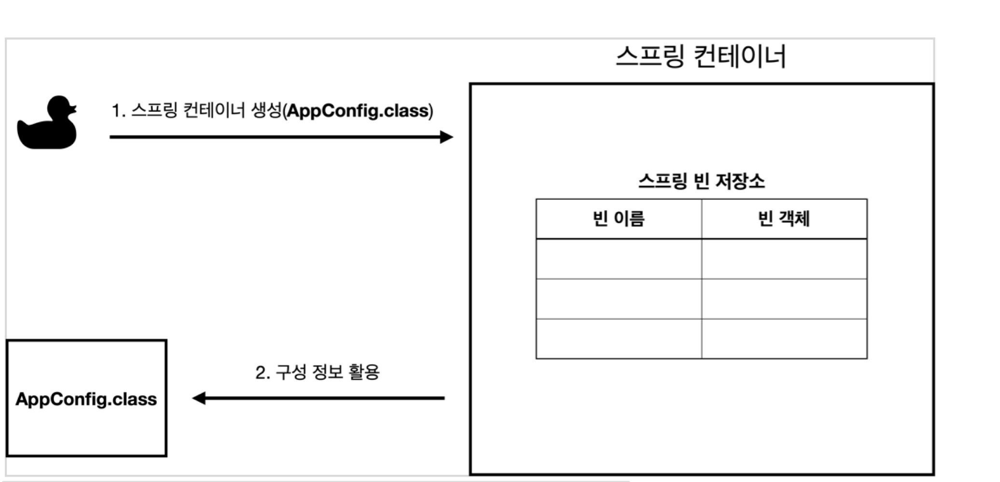
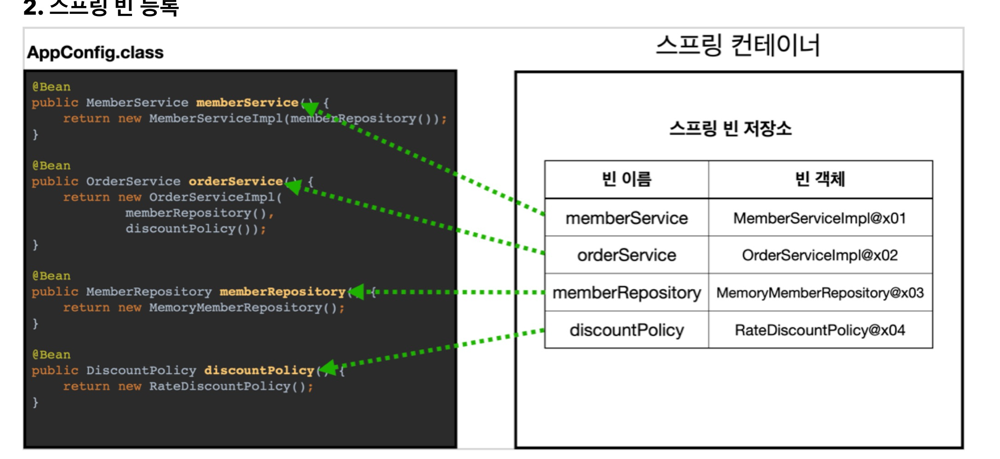
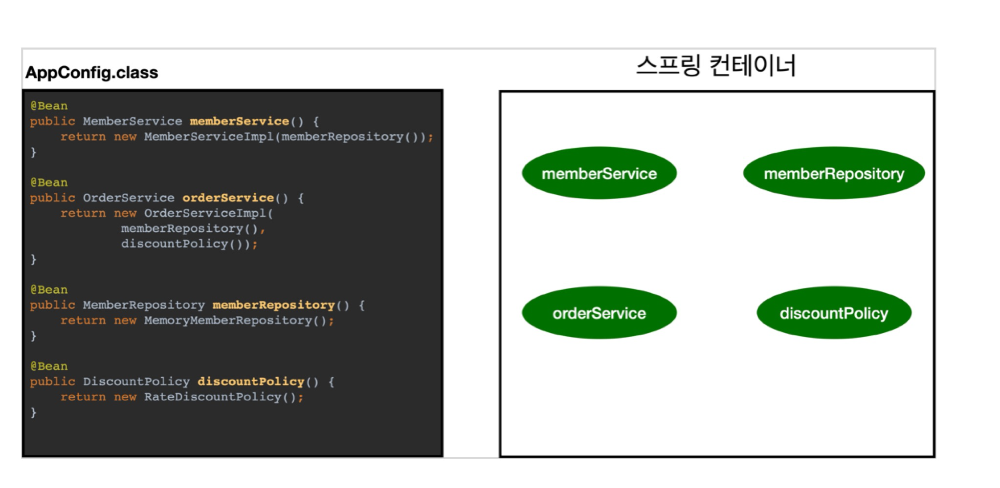
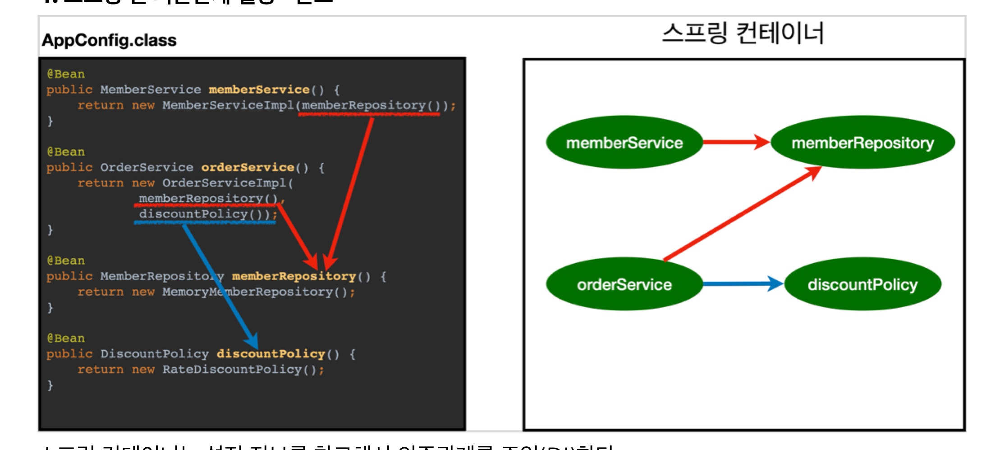
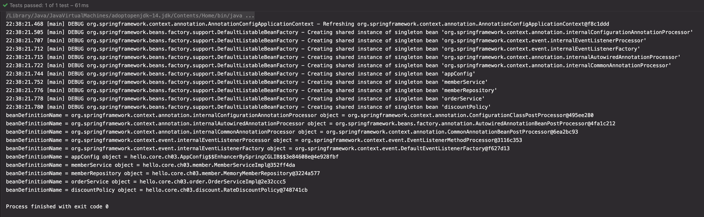
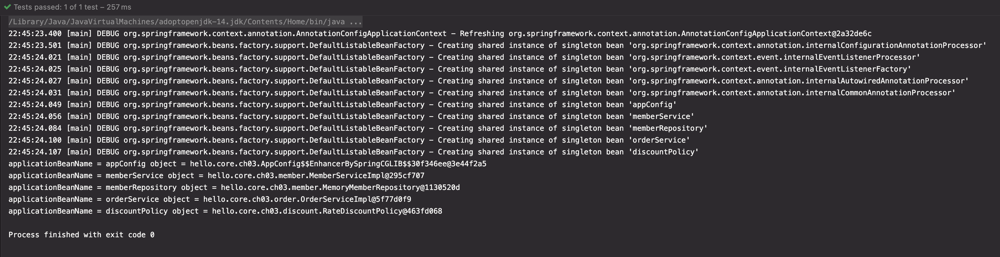
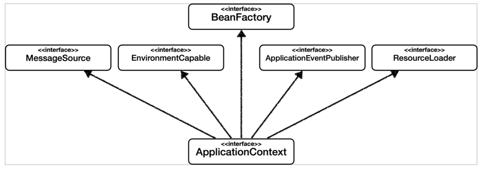
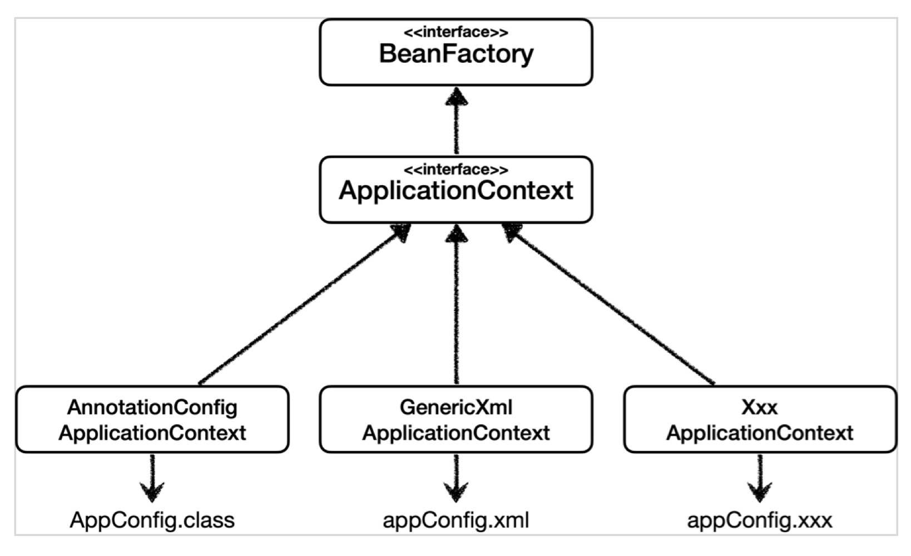
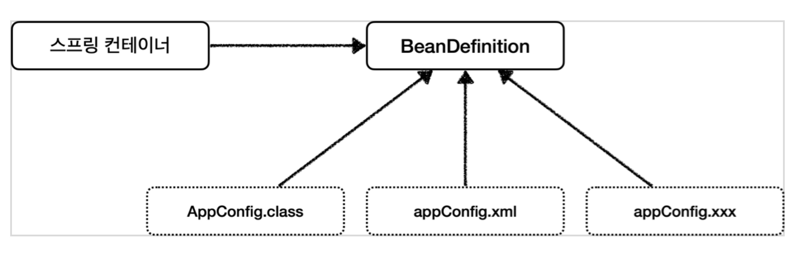
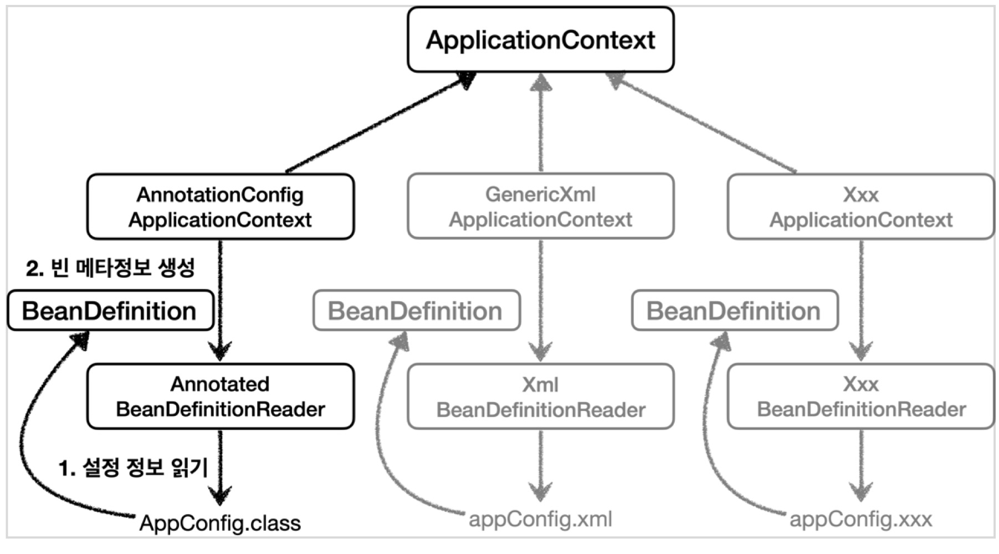

# [4] 스프링 핵심 원리 - 스프링 컨테이너와 스프링 빈

### 학습 목표

1. 스프링 컨테이너가 생성되는 과정을 알 수 있다.
2. 관심사를 분리해볼 수 있다.

## 1. 스프링 컨테이너의 생성

```java
ApplicationContext applicationContext = new AnnotationConfigApplicationContext(AppConfig.class);
```

- `ApplicationContext` 를 스프링 컨테이너라고 한다.
- `ApplicationContext` 는 인터페이스이다.
- 요즘은 **애노테이션 기반**의 자바 설정 클래스로 스프링 컨테이너를 만든다
  - `new AnnotationConfigApplicationContext(AppConfig.class);`
  - 이 클래스(AnnotationConfigApplicationContext) 는 `ApplicationContext` 인터페이스의 **구현체**


#### 1. 스프링 컨테이너 생성



- 스프링 컨테이너 생성 시 구성 정보를 지정해주어야 한다
  - 여기서는 `AppConfig.class` 를 구성 정보로 지정했다


#### 2. 스프링 빈 등록



- 스프링 컨테이너는 파라미터로 넘어온 설정 클래스 정보를 사용해서 (@Bean으로 지정된) 스프링 빈을 등록한다
- 빈 이름
  - 빈 이름은 메서드 이름을 사용한다
  - 빈 이름을 직접 부여할 수도 있다
    - `@Bean(name="memberService2")`

####  🧐 주의 !

- 빈 이름은 항상 다른 이름을 부여해야 한다
- 같은 이름을 부여하면, 다른 빈이 무시되거나, 기존 빈을 덮어버리거나 설정에 따라 오류가 발생한다.


#### 3. 스프링 빈 의존관계 설정 - 준비



#### 4. 스프링 빈 의존관계 설정 - 완료



- 스프링 컨테이너는 설정 정보를 참고해서 의존 관계를 주입 (DI)한다
- 단순히 자바 코드를 호출하는 것 같지만, 이 차이는 싱글톤 컨테이너에서 차이점이 있다.

> 참고
>
> - 스프링은 빈을 생성하고, 의존 관계를 주입하는 단계가 나누어져있다
> - 그런데, 이렇게 자바 코드로 스프링 빈을 등록하면, 생성자를 호출하면서 의존 관계 주입도 한 번에 처리된다.


### 정리

-  스프링 컨테이너를 생성하고, 설정 정보를 참고해서 스프링 빈도 등록하고, 의존 관계까지 설정을 완료했다!


## 2. 컨테이너에 등록된 모든 빈 조회

  스프링 컨테이너에 실제 스프링 빈이 잘 등록되었는지 확인해보자!

```java
package hello.core.beanfind;

import hello.core.AppConfig;
import org.junit.jupiter.api.DisplayName;
import org.junit.jupiter.api.Test;
import org.springframework.beans.factory.config.BeanDefinition;
import org.springframework.context.annotation.AnnotationConfigApplicationContext;

public class ApplicationContextInfoTest {

    AnnotationConfigApplicationContext ac = new AnnotationConfigApplicationContext(AppConfig.class);

    @Test
    @DisplayName("모든 빈 출력하기")
    void findAllBean() {
        String[] beanDefinitionNames = ac.getBeanDefinitionNames();

        for (String beanDefinitionName : beanDefinitionNames) {
            Object bean = ac.getBean(beanDefinitionName);
            System.out.println("name = " + beanDefinitionName + " object = " + bean);

        }
    }

    @Test
    @DisplayName("애플리케이션 빈 출력하기")
    void finaApplicationBean() {
        String[] beanDefinitionNames = ac.getBeanDefinitionNames();

        for (String beanDefinitionName : beanDefinitionNames) {
            BeanDefinition beanDefinition = ac.getBeanDefinition(beanDefinitionName);

            // 애플리케이션 개발을 위해 등록한 빈
            if (beanDefinition.getRole() == BeanDefinition.ROLE_APPLICATION) {
                Object bean = ac.getBean(beanDefinitionName);
                System.out.println("name = " + beanDefinitionName + " object = " + bean);
            }

        }
    }
}
```

- 모든 빈 출력하기
  - 테스트 코드 실행 시 스프링에 등록된 모든 빈 정보를 출력할 수 있다
  - `ac.getBeanDefinitionNames() ` : 스프링에 등록된 모든 빈 이름을 조회한다
  - `ac.getBean()` : 빈 이름으로 빈 객체 (인스턴스)를 조회한다

  ```java
  @Test
  @DisplayName("모든 빈 출력하기")
  void findAllBean() {
      String[] beanDefinitionNames = ac.getBeanDefinitionNames();
      for (String beanDefinitionName : beanDefinitionNames) {
          Object bean = ac.getBean(beanDefinitionName);
          System.out.println("beanDefinitionName = " + beanDefinitionName + " object = " + bean);
      }
  }
  ```

  - 상단의 5개 Bean은 Spring의 자체 확장을 위한 빈이다.


- 애플리케이션 빈만 출력하기
  - 스프링이 내부에서 사용하는 빈은 제외하고, 개발자가 등록한 빈만 출력해본다
  - `getRole()` 을 통해서 구분할 수 있다
    - **ROLE_APPLICATION** : 일반적으로 사용자가 정의한 빈
    - **ROLE_INFRASTRUCTURE** : 스프링이 내부에서 사용하는 빈
  ```java
  @Test
  @DisplayName("애플리케이션 빈 출력하기")
  void findApplicationBean() {
      String[] beanDefinitionNames = ac.getBeanDefinitionNames();
      for (String beanDefinitionName : beanDefinitionNames) {
          BeanDefinition beanDefinition = ac.getBeanDefinition(beanDefinitionName);

          // 외부 라이브러리나 애플리케이션 빈
          if (beanDefinition.getRole() == BeanDefinition.ROLE_APPLICATION) {
              Object bean = ac.getBean(beanDefinitionName);
              System.out.println("applicationBeanName = " + beanDefinitionName + " object = " + bean);
          }
      }
  }
  ```
 


## 3. 스프링 빈 조회 - 기본

  #### 스프링 컨테이너에서 스프링 빈을 찾는 가장 기본적인 조회 방법

- `ac.getBean(빈이름, 타입)`
- `ac.getBean(타입)`
- 조회 대상 스프링 빈이 없으면 예외 발생
  - `No SuchBeanDefinitionException : No bean named 'xxxxx' available`

```java
package hello.core.beanfind;

import hello.core.AppConfig;
import hello.core.member.MemberService;
import hello.core.member.MemberServiceImpl;
import org.assertj.core.api.Assertions;
import org.junit.jupiter.api.DisplayName;
import org.junit.jupiter.api.Test;
import org.springframework.beans.factory.NoSuchBeanDefinitionException;
import org.springframework.context.annotation.AnnotationConfigApplicationContext;

import static org.assertj.core.api.Assertions.*;
import static org.junit.jupiter.api.Assertions.*;

public class ApplicationContextBasicFindTest {

    AnnotationConfigApplicationContext ac = new AnnotationConfigApplicationContext(AppConfig.class);

    @Test
    @DisplayName("빈 이름으로 조회")
    void findBeanByName() {
        // given
        MemberService memberService = ac.getBean("memberService", MemberService.class);
        System.out.println("memberService = " + memberService);
        System.out.println("memberService.getClass() = " + memberService.getClass());

        // when

        // then
        assertThat(memberService).isInstanceOf(MemberServiceImpl.class);
    }

    @Test
    @DisplayName("이름 없이 타입으로만 조회")
    void findBeanByType() {
        // given
        MemberService memberService = ac.getBean("memberService", MemberService.class);
        assertThat(memberService).isInstanceOf(MemberServiceImpl.class);
    }

    @Test
    @DisplayName("구체 타입으로만 조회")
    void findBeanByName2() {
        // given
        MemberService memberService = ac.getBean("memberService", MemberServiceImpl.class);
        assertThat(memberService).isInstanceOf(MemberServiceImpl.class);
    }

    @Test
    @DisplayName("빈 이름으로 조회 X")
    void findBeanByNameX() {
        // given
//        MemberService memberService = ac.getBean("xxxxxxx", MemberService.class);
        assertThrows(NoSuchBeanDefinitionException.class, () -> ac.getBean("xxxxxxx", MemberService.class));

        assertThatThrownBy(() -> ac.getBean("xxxxx", MemberService.class))
                .isInstanceOf(NoSuchBeanDefinitionException.class);
    }

}
```


## 4. 스프링 빈 조회 - 동일한 타입이 둘 이상

- 타입으로 조회 시 같은 타입의 스프링 빈이 둘 이상이면 오류 발생
  - 오류 발생 시, 가져올 **빈 이름을 지정**하면 됨
  - `ac.getBeansOfType()` : 해당 타입의 모든 빈 조회 가능

```java
package hello.core.beanfind;

import hello.core.member.MemberRepository;
import hello.core.member.MemoryMemberRepository;
import org.junit.jupiter.api.DisplayName;
import org.junit.jupiter.api.Test;
import org.springframework.beans.factory.NoUniqueBeanDefinitionException;
import org.springframework.context.annotation.AnnotationConfigApplicationContext;
import org.springframework.context.annotation.Bean;
import org.springframework.context.annotation.Configuration;
import java.util.Map;
import static org.assertj.core.api.Assertions.assertThat;
import static org.junit.jupiter.api.Assertions.assertThrows

class ApplicationContextSameBeanFindTest {
		AnnotationConfigApplicationContext ac = new AnnotationConfigApplicationContext(SameBeanConfig.class);

  	@Test
		@DisplayName("타입으로 조회시 같은 타입이 둘 이상 있으면, 중복 오류가 발생한다")
		void findBeanByTypeDuplicate() {
        //DiscountPolicy bean = ac.getBean(MemberRepository.class);
        assertThrows(NoUniqueBeanDefinitionException.class, () -> ac.getBean(MemberRepository.class));
        assertThatThrownBy(() -> ac.getBean(MemberRepository.class))
                .isInstanceOf(NoUniqueBeanDefinitionException.class);
		}

		@Test
		@DisplayName("타입으로 조회시 같은 타입이 둘 이상 있으면, 빈 이름을 지정하면 된다")
		void findBeanByName() {
			MemberRepository memberRepository = ac.getBean("memberRepository1", MemberRepository.class);
      assertThat(memberRepository).isInstanceOf(MemberRepository.class);
    }

    @Test
    @DisplayName("특정 타입을 모두 조회하기")
    void findAllBeanByType() {
        Map<String, MemberRepository> beansOfType = ac.getBeansOfType(MemberRepository.class);
        for (String key : beansOfType.keySet()) {
            System.out.println("key = " + key + " value = " + beansOfType.get(key));
        }
        System.out.println("beansOfType = " + beansOfType);
        assertThat(beansOfType.size()).isEqualTo(2);
		}

    @Configuration
    static class SameBeanConfig {

    		@Bean
    		public MemberRepository memberRepository1() {
    				return new MemoryMemberRepository();
    		}

    		@Bean
    		public MemberRepository memberRepository2() {
    				return new MemoryMemberRepository();
    		}
    }
```


## 5. 스프링 빈 조회 - 상속 관계

- ⭐️ 만약, 스프링 빈이 상속 관계를 가질 때, **부모 타입으로 조회 시, 자식 타입도 함께 조회된다**
- 모든 자바 객체의 최고 부모인  **`Object` 타입으로 조회** 시, 모든 스프링 빈을 조회하게 된다


- 아래와 같은 테스트 코드 내에서, `ac.getBean(DiscountPolicy.class);` 를 통해 부모 타입의 빈을 조회하면,
  - `TestConfig` 에 `DiscountPolicy` 의 자식 빈으로 `RateDiscountPolicy` 와 `FixDiscountPolicy` 가 선언되어있으므로,
    - `NoUniqueBeanDefinitionException` 예외가 발생하게 된다!
      - 📌 스프링 빈이 상속 관계를 가질 때, 부모 타입으로 조회 시, 자식 타입도 함께 조회되기 때문이다

```java
public class ApplicationContextExtendsFindTest {

    AnnotationConfigApplicationContext ac = new AnnotationConfigApplicationContext(TestConfig.class);

    @Test
    @DisplayName("부모 타입으로 조회 시, 자식이 둘 이상 있으면, 중복 오류가 발생한다")
    void findBeanByParentTypeDuplicate() {
        assertThrows(NoUniqueBeanDefinitionException.class,
                () -> ac.getBean(DiscountPolicy.class));
        assertThatThrownBy(() -> ac.getBean(DiscountPolicy.class))
                .isInstanceOf(NoUniqueBeanDefinitionException.class);
    }

    @Configuration
    static class TestConfig {

        @Bean
        public DiscountPolicy rateDiscountPolicy() {
            return new RateDiscountPolicy();
        }

        @Bean
        public DiscountPolicy fixDiscountPolicy() {
            return new FixDiscountPolicy();
        }
    }
}
```

- 따라서, 중복 오류를 방지하기 위해, 빈 조회 시 빈 이름을 지정하여 조회하면 된다

  ```java
  @Test
  @DisplayName("부모 타입으로 조회시, 자식이 둘 이상 있으면, 빈 이름을 지정하면 된다")
  void findBeanByParentTypeBeanName() {
    	DiscountPolicy rateDiscountPolicy = ac.getBean("rateDiscountPolicy", DiscountPolicy.class);
    	assertThat(rateDiscountPolicy).isInstanceOf(RateDiscountPolicy.class);
  }
  ```

  ```java
  @Test
  @DisplayName("부모 타입으로 조회 시, 자식이 둘 이상 있으면, 특정 하위 타입 빈을 지정하면 된다")
  void findBeanBySubType() {
      RateDiscountPolicy bean = ac.getBean(RateDiscountPolicy.class);
      assertThat(bean).isInstanceOf(RateDiscountPolicy.class);
  }

  @Test
  @DisplayName("부모 타입으로 모두 조회하기")
  void findAllBeanByParentType() {
      Map<String, DiscountPolicy> beansOfType = ac.getBeansOfType(DiscountPolicy.class);
      assertThat(beansOfType.size()).isEqualTo(2);
      for (String key : beansOfType.keySet()) {
          System.out.println("key = " + key + " value = " + beansOfType.get(key));
      }
  }

  @Test
  @DisplayName("부모 타입으로 모두 조회하기 - Object")
  void findAllBeanByObjectType() {
      Map<String, Object> beansOfType = ac.getBeansOfType(Object.class);
      for (String key : beansOfType.keySet()) {
          System.out.println("key = " + key + " value = " + beansOfType.get(key));
      }
  }
  ```


## 6. BeanFactory와 ApplicationContext

⭐️ **BeanFactory**와 **ApplicationContext**에 대해서 알아보자


### BeanFactory
- **스프링 컨테이너의 최상위 인터페이스**
- BeanFactory는 스프링 빈을 관리하고 조회하는 역할 담당한다
- `getBean` 을 제공한다

### ApplicationContext

- BeanFactory 기능을 모두 상속받아서 제공한다
- 빈을 관리하고 검색하는 기능을 BeanFactory가 제공해주는데, 그러면 BeanFactory와 ApplicationContext 둘의 차이는??
  - 애플리케이션을 개발할 때는 빈을 관리하고 조회하는 기능은 물론이고, +a 가 더 필요하다 !


#### ApplicationContext 가 제공하는 부가 기능은 무엇?

ApplicationContext는 여러 가지 인터페이스들을 구현하고 있다. BeanFactory에 더해서 아래와 같은 부가 기능을 제공한다



- `MessageSource` : 메시지 소스를 활용한 국제화 기능
  - ex)  한국에서 들어오면 한국어로, 영어권에서 들어오면 영어로 출력
- `EnvironmentCapable` : 환경 변수
  - 로컬 /  개발 / 운영 등의 환경을 구분하여 처리
- `ApplicationEventPublisher` : 애플리케이션 이벤트
  - 이벤트를 발행하고 구독하는 모델을 편리하게 지원
- `ResourceLoader` : 편리한 리소스 조회
  - 파일, 클래스패스, 외부 등에서 리소스를 편리하게 조회할 수 있도록 지원


### 정리

- `ApplicationContext`는 `BeanFactory`의 기능을 상속받는다
- `ApplicationContext`는 **빈 관리 기능 + 편리한 부가 기능**을 제공한다
- `BeanFactory` 를 직접 사용할 일은 거의 없고, 부가 기능이 포함된 `ApplicationContext`를 사용한다
- `BeanFactory` 나 `ApplicationContext` 를 **스프링 컨테이너**라고 한다

## 7. 다양한 설정 형식 지원 - 자바 코드, XML
  스프링 컨테이너는 다양한 형식의 설정 정보를 받아들일 수 있도록 유연하게 설계되어 있다.

- 자바 코드, XML, Groovy 등등



- 위의 그림처럼, `ApplicationContext` 구현한 것들을 볼 수 있다 (스프링이 얼마나 유연하게 설정할 수 있는지에 집중해보자)


### 1. Annotation 기반 자바 코드 설정 사용하여 ApplicationContext 이용

```java
new AnnotationConfigApplicationContext(AppConfig.class);
```

- `AnnotationConfigApplicationContext` 클래스를 사용하면서, 자바 코드로 된 설정 정보를 넘기면 됨


### 2. XML 설정 사용하여 ApplicationContext 이용

- 최근에는 잘 사용하지 않는다.
  - XML을 사용하면, 컴파일 없이 빈 설정 정보를 변경할 수 있는 장점이 있긴 하다.

- `GenericXmlApplicationContext` 를 사용하면서 xml 파일을 넘기면 된다
  ```java
  @Test
  void xmlAppContext() {
      ApplicationContext ac = new GenericXmlApplicationContext("appConfigTest.xml");
      MemberService memberService = ac.getBean("memberService", MemberService.class);
      assertThat(memberService).isInstanceOf(MemberService.class);
  }
  ```

  ```XML
  <?xml version="1.0" encoding="UTF-8"?>
  <beans xmlns="http://www.springframework.org/schema/beans"
         xmlns:xsi="http://www.w3.org/2001/XMLSchema-instance"
         xsi:schemaLocation="http://www.springframework.org/schema/beans http://www.springframework.org/schema/beans/spring-beans.xsd">

      <bean id="memberService" class="hello.core.ch03.member.MemberServiceImpl">
          <constructor-arg name="memberRepository" ref="memberRepository"/>
      </bean>

      <bean id="memberRepository" class="hello.core.ch03.member.MemoryMemberRepository"></bean>

      <bean id="orderService" class="hello.core.ch03.order.OrderServiceImpl">
          <constructor-arg name="memberRepository" ref="memberRepository"/>
          <constructor-arg name="discountPolicy" ref="discountPolicy"/>
      </bean>

      <bean id="discountPolicy" class="hello.core.ch03.discount.RateDiscountPolicy"></bean>
  </beans>
  ```

## 8. 스프링 빈 설정 메타 정보 - BeanDefinition

  🤔 스프링은 어떻게 이런 다양한 설정 형식을 지원하는 것일까?  그 중심에는 **`BeanDefinition`** 이라는 추상화가 있기 때문!


- **역할과 구현**을 개념적으로 잘 나눈 것
  - XML 을 읽어서 `BeanDefinition` 을 만들면 된다
  - 자바 코드를 읽어서 `BeanDefinition` 을 만들면 된다
  - **스프링 컨테이너 입장**에서는 **어떤 설정 형식이든 상관없다**. `BeanDefinition` 만 알면 된다!

- `BeanDefinition` : 빈 설정 메타 정보
  - `@Bean`, `<bean>` 당 각각 하나씩 메타 정보가 생성된다
- 스프링 컨테이너는 **이 메타 정보를 기반으로 스프링 빈을 생성**하게 된다
  - ⭐️ 스프링 컨테이너는 `BeanDefinition` 에만 의존한다 (추상화에만 의존한다 - `BeanDefinition` 자체가 인터페이스이다)


### 코드 레벨로 조금 더 들어가보자 !



```java
public class AnnotationConfigApplicationContext extends GenericApplicationContext implements AnnotationConfigRegistry {

		private final AnnotatedBeanDefinitionReader reader;

		private final ClassPathBeanDefinitionScanner scanner;
}
```
- `AnnotationConfigApplicationContext` 는
  -  `AnnotatedBeanDefinitionReader` 를 사용해서 `AppConfig.class` 의 설정 정보를 읽고, `BeanDefinition` 을 생성한다. (빈의 메타정보를 담아둠)
- `GenericXmlApplicationContext` 도 유사하다
  - `XmlBeanDefinitionReader` 를 사용해서 `appConfig.xml` 의 설정 정보를 읽고, `BeanDefinition` 을 생성한다

```java
public class GenericXmlApplicationContext extends GenericApplicationContext {

		private final XmlBeanDefinitionReader reader = new XmlBeanDefinitionReader(this);
}
```


### BeanDefinition 살펴보기

```java
public class BeanDefinitionTest {

    AnnotationConfigApplicationContext ac = new AnnotationConfigApplicationContext(AppConfig.class);
		// GenericXmlApplicationContext gxac = new GenericXmlApplicationContext("appConfig.xml");

    @Test
    @DisplayName("빈 설정 메타정보 확인")
    void findApplicationBean() {
        String[] beanDefinitionNames = ac.getBeanDefinitionNames();
        for (String beanDefinitionName : beanDefinitionNames) {
            BeanDefinition beanDefinition = ac.getBeanDefinition(beanDefinitionName);

            if (beanDefinition.getRole() == BeanDefinition.ROLE_APPLICATION) {
                System.out.println("beanDefinitionName = " + beanDefinitionName +
                        " beanDefinition = " + beanDefinition);
            }
        }
    }
}
```
- 위의 메타 정보를 기반으로 실제 인스턴스를 생성할 수 있는 것이다 !


### 정리
- `BeanDefinition` 을 직접 생성하여 스프링 컨테이너에 등록할 수도 있다. 근데, 실무에서는 `BeanDefinition` 을 직접 정의하거나 사용할 일은 거의 없다 !
- 스프링이 다양한 형태의 설정 정보를 BeanDefinition으로 추상화해서 사용하고 있구나 정도로만 알고 있자

## 출처

[인프런 - 스프링 핵심원리 - 기본편](https://www.inflearn.com/course/%EC%8A%A4%ED%94%84%EB%A7%81-%ED%95%B5%EC%8B%AC-%EC%9B%90%EB%A6%AC-%EA%B8%B0%EB%B3%B8%ED%8E%B8)
