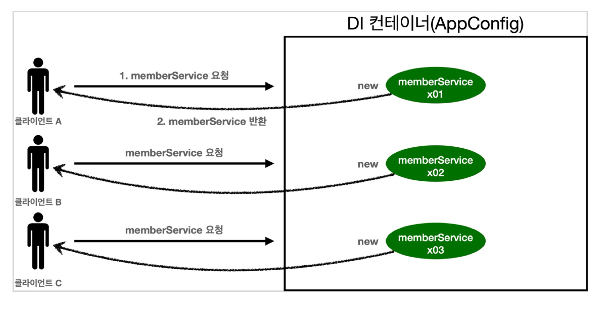
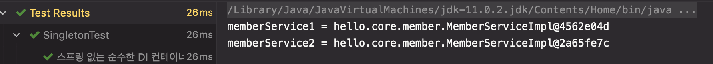
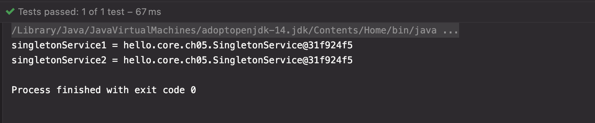
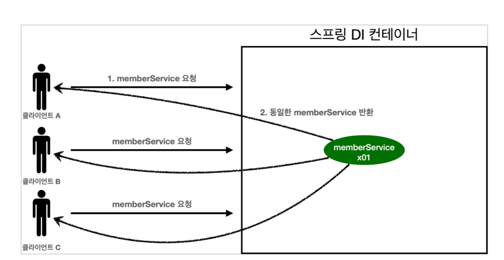
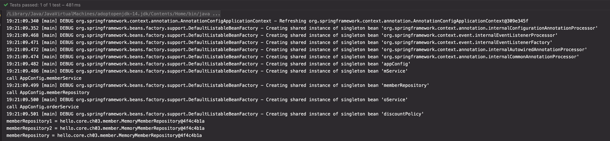
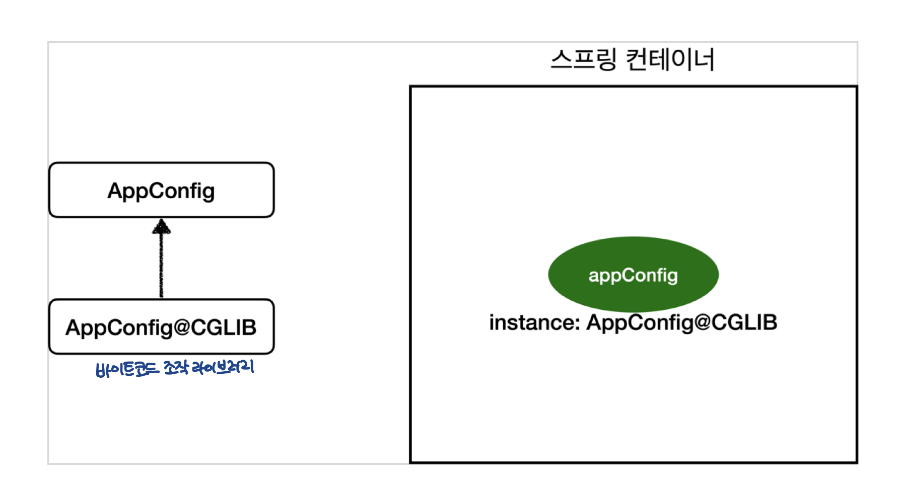
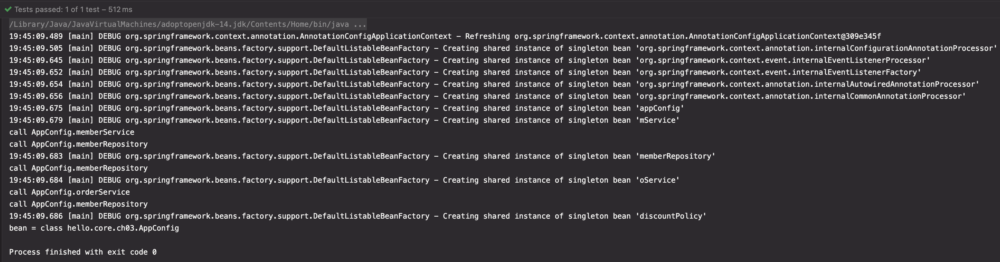

# [5] 스프링 핵심 원리 - 싱글톤 컨테이너

### 학습 목표

1. 싱글톤 패턴이 무엇인지 안다.
2. 싱글톤 컨테이너를 알고, 주의점을 안다.
3. 스프링이 제공하는 @Configuration의 의미를 안다.


## 1. 웹 애플리케이션과 싱글톤

- 웹 애플리케이션은 보통 여러 고객이 동시에 요청을 한다.



- 클라이언트가 요청하면, `memberService` 객체가 3개 생성된다
  - 요청이 올 때마다 객체를 만들게 되면 문제가 생긴다 !!!

```java
@Test
@DisplayName("스프링 없는 순수한 DI 컨테이너")
void pureContainer() {
		// given
		AppConfig appConfig = new AppConfig();
		// 1. 조회 : 호출할 때 마다 객체를 생성
		MemberService memberService1 = appConfig.memberService();
		// when
		// 2. 조회 : 호출할 때 마다 객체를 생성
		MemberService memberService2 = appConfig.memberService();

		// then
		// 참조값이 다른 것을 확인
		System.out.println("memberService1 = " + memberService1);
		System.out.println("memberService2 = " + memberService2);
    Assertions.assertThat(memberService1).isNotSameAs(memberService2);
}
```



- 이렇게, 스프링이 없는 순수한 DI 컨테이너인 `AppConfig` 는 호출할 때 마다 **객체를 새로 생성 (JVM 메모리에 객체가 새로 생성된다)**
  - **메모리 낭비가 너무 심하다**
- 🤔 해결방안 : 해당 객체가 딱 1개만 생성되고, 공유하도록 설계한다 -> **Singleton 패턴**


## 2. Singleton Pattern

- **클래스의 인스턴스가 딱 1개만 생성되는 것을 보장**하는 디자인 패턴이다.
- 그래서 **객체 인스턴스를 2개 이상 생성하지 못하도록 막아야 한다.**

- ⭐️ **private 생성자**를 사용해서 외부에서 **임의로 new 키워드를 사용하지 못하도록** 막아야 함

```java
public class SingletonService {

    // 1. static 영역에 객체를 딱 1개만 생성해둔다
    private static final SingletonService instance = new SingletonService();

    // 2. public으로 열어서 객체 인스턴스가 필요하면 이 static 메서드를 통해서만 조회하도록 허용한다
    // 이 메서드를 호출하면 항상 같은 인스턴스를 반환한다
    public static SingletonService getInstance() {
        return instance;
    }

    // 3. 생성자를 private으로 선언해서 외부에서 new 키워드를 사용한 객체 생성을 못하게 막는다
    private SingletonService() {

    }

    public void logic() {
        System.out.println("싱글톤 객체 로직 호출");
    }

}
```
1. static 영역에 객체 instance를 미리 하나 생성해서 올려둔다
2. 이 객체 인스턴스가 필요하면 오직 `getInstance()` 메서드를 통해서만 조회할 수 있다
   - 이 메서드를 호출하면 항상 같은 인스턴스를 반환한다
3. 딱 1개의 객체 인스턴스만 존재해야 하므로, 생성자를 **private**으로 막아서 혹시라도 **외부에서 new 키워드로 객체 인스턴스가 생성되는 것을 막는다**


- 외부에서 new 키워드로 객체 인스턴스를 생성하려고 하면, 위와 같은 컴파일 에러 메시지가 나온다.


```java
@Test
@DisplayName("싱글톤 패턴을 적용한 객체 사용")
void singletonServiceTest() {
  	// private 으로 생성자를 막아서, 외부에서 new 로 객체 인스턴스 생성 시, 컴파일 오류가 발생한다
    // new SingletonService();

		// given
  	// 1. 조회 : 호출할 때 마다 같은 객체를 반환
		SingletonService singletonService1 = SingletonService.getInstance();
  	// 2. 조회 : 호출할 때 마다 같은 객체를 반환
		SingletonService singletonService2 = SingletonService.getInstance();

		// when
  	// 참조값이 같은 것을 확인
		System.out.println("singletonService1 = " + singletonService1);
		System.out.println("singletonService2 = " + singletonService2);

		// then
  	// singletonService1 == singletonService2
		Assertions.assertThat(singletonService1).isSameAs(singletonService2);
}
```

- 싱글톤 패턴을 적용하여 객체 생성을 하였으므로, **호출할 때 마다 같은 객체 인스턴스를 반환하는 것**을 확인할 수 있다!
- 스프링에서는, 스프링 컨테이너가 알아서 객체를 모두 Singleton으로 만든다


##### 싱글톤 패턴을 사용하면, 고객의 요청이 올 때 마다 객체를 생성하는 것이 아니라, 이미 만들어진 객체를 공유해서 효율적으로 사용할 수 있다. 그러나, 이러한 싱글톤 패턴은 아래와 같은 문제점을 가진다.


### 싱글톤 패턴의 문제점
- 싱글톤 패턴을 구현하는 코드 자체가 많이 들어간다

  - ```java
    private static final SingletonService instance = new SingletonService();

    public static SingletonService getInstance() {
      	return instance;
    }

    private SingletonService() {}
    ```

- 의존관계상 클라이언트가 구체 클래스에 의존하여, DIP를 위반한다
  - ```java
    MemberServiceImpl.getInstance(...);
    ```
- 클라이언트가 구체 클래스에 의존하기 때문에 OCP 원칙을 위반할 가능성이 높다
- 유연하게 테스트하기 어렵다
- 내부 속성을 변경하거나 초기화 하기 어렵다
- private 생성자로 자식 클래스를 만들기 어려워진다
- 결론적으로 유연성이 떨어져 안티패턴으로 불리기도 한다
<br/>
- 📌 스프링은 싱글톤 패턴의 문제점을 해결하였다. 다음에는 스프링이 싱글톤 패턴의 문제점을 어떻게 해결하였는지 알아보자 !


## 3. 싱글톤 컨테이너
- 스프링 컨테이너는 싱글톤 패턴의 문제점을 해결하면서, 객체 인스턴스를 싱글톤으로 관리한다 (1개만 생성하여 관리한다)


### **싱글톤 컨테이너**
- 스프링 컨테이너는 **싱글턴 패턴을 적용하지 않아도, 객체 인스턴스를 싱글톤으로 관리**한다
  - 이전에 설명한 컨테이너 생성 과정을 자세히 보자. 컨테이너는 객체를 하나만 생성해서 관리한다.

- 스프링 컨테이너는 **싱글톤 컨테이너 역할**을 한다
- 이렇게 싱글톤 객체를 생성하고 관리하는 기능을 **싱글톤** **레지스트리** 라고 한다
- 이렇게 되면, **싱글톤 패턴의 모든 단점을 해결하면서, 객체를 싱글톤으로 유지할 수 있다**
  - 싱글톤 패턴을 위한 지저분한 코드가 들어가지 않아도 된다
  - DIP, OCP, 테스트, private 생성자로 부터 자유롭게 싱글톤을 사용할 수 있다

#### 스프링 컨테이너를 사용하는 테스트 코드
```java
@Test
@DisplayName("스프링 컨테이너와 싱글톤")
void springContainer() {
    // given
    ApplicationContext ac = new AnnotationConfigApplicationContext(AppConfig.class);

  	// when
  	MemberService memberService1 = ac.getBean("memberService", MemberService.class);
  	MemberService memberService2 = ac.getBean("memberService", MemberService.class);

  	// then
  	System.out.println("memberService1 = " + memberService1);
  	System.out.println("memberService2 = " + memberService2);

  	Assertions.assertThat(memberService1).isSameAs(memberService2);
}
```


- 스프링 컨테이너 덕분에 고객의 요청이 올 때 마다 객체를 생성하는 것이 아닌, **이미 만들어진 객체를 공유** 해서 효율적으로 **재사용** 한다


> ❗️참고
> - 스프링의 기본 빈 등록 방식은 싱글톤이지만, 싱글톤 방식만 지원하는 것은 아니다
> - 요청할 때 마다 새로운 객체를 생성해서 반환하는 기능도 제공한다


## 4. 싱글톤 방식의 주의점

  싱글톤 패턴이든, 스프링 같은 싱글톤 컨테이너를 사용하든간에, 싱글톤 패턴은 주의할 점이 있다.

- 싱글톤 방식은 여러 클라이언트가 하나의 같은 객체 인스턴스를 공유하기 때문에, 싱글톤 객체는 **상태를 유지 (stateful)하게 설계하면 안된다**
- 📌  **무상태(stateless)** 로 설계해야 한다!
  - 특정 클라이언트에 의존적인 필드가 있으면 안된다
  - 특정 클라이언트가 값을 변경할 수 있는 필드가 있으면 안된다
  - 가급적 읽기만 가능해야 한다 (값을 수정하면 안된다)
  - 필드 대신에 자바에서 공유되지 않는, 지역변수, 파라미터, ThreadLocal 등을 사용해야 한다
- 스프링 빈의 필드에 공유 값을 설정하면 정말 큰 장애가 발생할 수 있다

#### 상태를 유지할 경우 발생하는 문제점 예제

```java
package hello.core.singleton;

public class StatefulService {

    private int price; // 상태를 유지하는 필드

    public void order(String name, int price) {
        System.out.println("name = " + name + " price = " + price);
        this.price = price; // 이 코드가 문제가 된다
    }

    public int getPrice() {
        return price;
    }
}
```

```java
@Test
@DisplayName("상태를 유지할 경우 발생하는 문제점")
void statefulServiceSingleton() {
    ApplicationContext ac = new AnnotationConfigApplicationContext(TestConfig.class);
    StatefulService statefulService1 = ac.getBean("statefulService", StatefulService.class);
    StatefulService statefulService2 = ac.getBean("statefulService", StatefulService.class);

    // ThreadA : 사용자A 10000원 주문
    statefulService1.order("userA", 10000);
    // ThreadB : 사용자B 20000원 주문
    statefulService2.order("userB", 20000);

    // ThreadA : 사용자A 주문 금액 조회
    int price1 = statefulService1.getPrice();
    System.out.println("price1 = " + price1);

    Assertions.assertThat(statefulService1.getPrice()).isEqualTo(20000);
}

static class TestConfig {
    @Bean
    public StatefulService statefulService() {
      return new StatefulService();
    }
}
```
- **공유 필드인 `price` 필드를 특정 클라이언트가 값을 변경한다**
  - 그래서, 각 사용자에 대한 price 값이 휙휙 바뀐다 => 망함
- ⭐️ 스프링에서는 빈을 항상 **무상태(stateless)** 로 설계해야 한다!!!
  ```java
  public class StatefulService {
      public int order(String name, int price) {
          System.out.println("name = " + name + " price = " + price);
          return price;
      }
  }
  ```

## 5. @Configuration과 싱글톤
그런데, 이상한 점이 있다.

```java
@Configuration
public class AppConfig {
      @Bean
      public MemberService memberService() {
          return new MemberServiceImpl(memberRepository());
      }
      @Bean
      public OrderService orderService() {
          return new OrderServiceImpl(
                  memberRepository(),
                  discountPolicy());
}
      @Bean
      public MemberRepository memberRepository() {
          return new MemoryMemberRepository();
      }
```

- `memberService` 빈을 만드는 코드를 보면, `memberRepository()` 를 호출한다
  - 이 메서드를 호출하면, `new MemoryMemberRepository()` 를 호출한다

- `orderService` 빈을 만드는 코드도 동일하게 `memberRepository()` 를 호출한다
  - 이 메서드를 호출하면, `new MemoryMemberRepository()` 를 호출한다

- 🧐 결과적으로, 각각 다른 2개의 `MemoryMemberRepository ` 가 생성되면서 **싱글톤이 깨지는 것처럼 보이는데...** 스프링 컨테이너는 어떻게 이 문제를 해결할까?


#### Test

```java
public class ConfigurationSingletonTest {
    @Test
    @DisplayName("싱글톤 테스트")
    void configurationTest() {
        // given
        AnnotationConfigApplicationContext ac = new AnnotationConfigApplicationContext(AppConfig.class);

        // when
        MemberServiceImpl memberService = ac.getBean("memberService", MemberServiceImpl.class);
        OrderServiceImpl orderService = ac.getBean("orderService", OrderServiceImpl.class);
        MemberRepository memberRepository = ac.getBean("memberRepository", MemberRepository.class);

        // then
        MemberRepository memberRepository1 = memberService.getMemberRepository();
        MemberRepository memberRepository2 = orderService.getMemberRepository();

        System.out.println("memberService -> memberRepository = " + memberRepository1);
        System.out.println("orderService -> memberRepository = " + memberRepository2);
        System.out.println("memberRepository = " + memberRepository);

        Assertions.assertThat(memberRepository1).isSameAs(memberRepository2).isSameAs(memberRepository);
    }
}
```
- memberRepository 인스턴스는 모두 같은 인스턴스가 공유되어 사용된다...
- AppConfig를 보면 분명히 각각 2번 `new MemoryMemberRepository` 를 호출해서 다른 인스턴스가 생성되어야 하는데.. 뭘까?? 로그를 찍어서 확인해보자 <br/>
<br/>

```java
@Configuration
public class AppConfig {

    @Bean
    public MemberService memberService() {
        System.out.println("call AppConfig.memberService");
        return new MemberServiceImpl(memberRepository());
    }

    @Bean
    public MemberRepository memberRepository() {
        System.out.println("call AppConfig.memberRepository");
        return new MemoryMemberRepository();
    }

    @Bean
    public OrderService orderService() {
        System.out.println("call AppConfig.orderService");
        return new OrderServiceImpl(memberRepository(), discountPolicy());
    }
    @Bean
    public DiscountPolicy discountPolicy() {
//        return new FixDiscountPolicy();
        return new RateDiscountPolicy();
    }
}
```
- 스프링 컨테이너가 각각 @Bean을 호출해서 스프링 빈을 생성한다.
- 🤔  그러면, `memberRepository()` 는 총 3번이 호출되어야 하는 것 아닌가?
  1. 스프링 컨테이너가 스프링 빈에 등록하기 위해 @Bean이 붙어있는 `memberRepository()` 호출
  2. `memberService()` 로직에서 `memberRepository()` 호출
  3. `orderService()` 로직에서 `memberRepository()` 호출


- 📌 그런데, 출력 결과 `memberRepository` 는 한 번만 호출이 된다


## 6. @Configuration과 바이트 코드 조작의 마법
스프링 컨테이너는 싱글톤 레지스트리이다. 따라서 스프링 빈이 싱글톤이 되도록 보장해주어야 한다. 그런데 스프링이 자바 코드까지 어떻게 하기는 어렵다... 이전의 자바 코드를 보면 분명 3번 호출되어야 하는데.. 뭘까?!

```java
@Test
void configurationDeep() {
    ApplicationContext ac = new AnnotationConfigApplicationContext(AppConfig.class);
    AppConfig bean = ac.getBean(AppConfig.class);
    System.out.println("bean = " + bean.getClass());
}
```
- `AnnotationConfigApplicationContext` 에 파라미터로 넘긴 값은 스프링 빈으로 등록된다. 그래서 , `AppConfig` 도 스프링 빈이 된다

- 클래스 정보를 출력해서 보면, 위와 같이 출력되는데...
  - 순수한 클래스라면 `class hello.core.ch03.AppConfig` 와 같이 출력되어야 한다
  - 클래스명에 `CGLIB` 가 붙은 건 뭘까?
    - 🧐 이건 개발자가 만든 클래스가 아니라 스프링이 `CGLIB` 라는 바이트코드 조작 라이브러리를 사용해서 `AppConfig` 클래스를 상속받은 임의의 다른 클래스를 만들고, 그 다른 클래스를 스프링 빈으로 등록한 것이다!!!!


#### AppConfig@CGLIB 예상 코드
```java
@Bean
public MemberRepository memberRepository() {
  if (MemoryMemberRepository가 이미 스프링 컨테이너에 등록되어 있으면?) {
    return 스프링 컨테이너에서 찾아서 반환해라;
  } else { // 스프링 컨테이너에 없으면
    기존 로직을 호출해서 MemoryMemberRepository 을 생성하고 스프링 컨테이너에 등록해라;
    return 반환해라;
  }
}
```
- @Bean이 붙은 메서드마다 이미 스프링 빈이 존재하면 이미 존재하는 빈을 반환하고, 스프링 빈이 없으면 생성해서 스프링 빈으로 등록하고 반환하는 코드가 동적으로 만들어진다.
- 덕분에 **싱글톤이 보장된다**
<br/>

### 🤔 `@Configuration` 을 적용하지 않고, `@Bean` 만 적용하면 어떻게 될까?
- `@Configuration` 을 사용하면, 바이트코드를 조작하는 CGLIB 기술을 사용해서 싱글톤을 보장한다
- 
- 그런데...
  - 
  - `memberRepository` 가 3번 호출된 것을 확인할 수 있다 => 다른 싱글톤이 깨짐!

#### 결론
- ⭐️ `@Bean` 만 사용해도 스프링 빈으로 등록되지만, 싱글톤을 보장하지 않는다!
  - `memberRepository()` 처럼 의존 관계 주입이 필요해서 메서드를 직접 호출하는 경우에 싱글톤을 보장하지 않는다
- ⭐️ `@Configuration` 을 사용해서 스프링 설정 정보를 사용하도록 하자


## 출처

[인프런 - 스프링 핵심원리 - 기본편](https://www.inflearn.com/course/%EC%8A%A4%ED%94%84%EB%A7%81-%ED%95%B5%EC%8B%AC-%EC%9B%90%EB%A6%AC-%EA%B8%B0%EB%B3%B8%ED%8E%B8)
