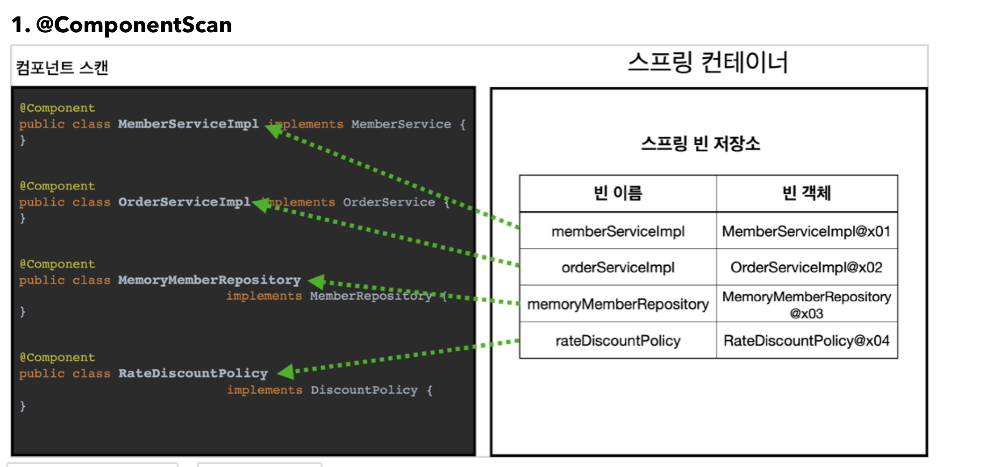
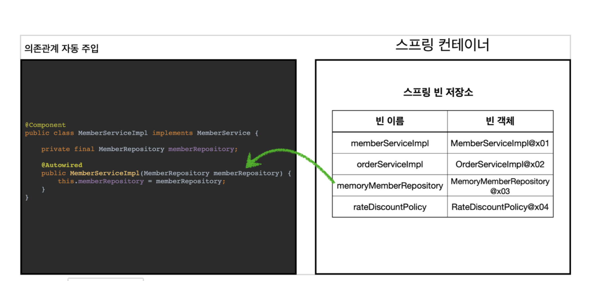
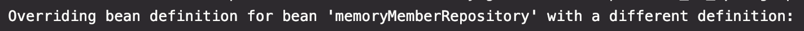

# [6] 스프링 핵심 원리 - 컴포넌트 스캔

### 학습 목표
1. 컴포넌트 스캔과 의존 관계 자동 주입을 안다.
2. 컴포넌트 스캔의 탐색 위치와 기본 스캔 대상을 안다.


## 1. 컴포넌트 스캔과 의존관계 자동 주입 시작하기
  - 지금까지 스프링 빈 등록 시, 자바 코드의 @Bean 이나 XML의 <bean> 을 통해서 설정 정보에 직접 등록할 스프링 빈을 나열했다.
  - 이렇게 되면, 일일이 등록 해야하는 귀찮음이 있다.

그래서 스프링은 설정 정보가 없어도 자동으로 스프링 빈을 등록하는 컴포넌트 스캔이라는 기능을 제공한다.

```java
@Configuration
@ComponentScan(
	excludeFilters = @Filter(type = FilterType.ANNOTATION, classes = Configuration.class)
)
public class AutoAppConfig {

}
```
- 컴포넌트 스캔을 사용하려면, `@ComponentScan` 설정 정보를 붙여주면 됨
> 참고
> - 컴포넌트 스캔을 사용하면 `@Configuration` 이 붙은 설정 정보도 자동으로 등록되기 때문에, 기존 예제의 설정 정보들도 함께 등록되고, 실행되어 버린다
> 그래서 여기서는 `excludeFilters` 를 사용하면 해당 설정정보는 컴포넌트 스캔 대상에서 제외된다!!
> - `@Configuration` 도 소스코드를 보면 `@Component` 어노테이션이 붙어있기 때문에 컴포넌트 스캔 대상이 된다

- 이전에 `AppConfig` 에서는 `@Bean` 으로 직접 설정 정보를 작성했고, 의존 관계도 명시했는데, 지금은 이런 설정 정보 자체가 없기 때문에
- 의존 관계 주입도 클래스 안에서 명시해주어야 한다 => `@Autowired` 로 의존 관계를 자동으로 주입해준다!

```java
public class AutoAppConfigTest {

    @Test
    void basicScan() {
        AnnotationConfigApplicationContext ac = new AnnotationConfigApplicationContext(AutoAppConfig.class);

        MemberService memberService = ac.getBean(MemberService.class);
        Assertions.assertThat(memberService).isInstanceOf(MemberService.class);
    }
}
```


### 컴포넌트 스캔과 자동 의존 관계 주입이 어떻게 동작하는지
1. @ComponentScan

   - @Component가 붙은 모든 클래스를 스프링 빈으로 등록함
     - 빈 이름 기본 전략 : 클래스명을 사용하되, 맨 앞글자만 소문자를 사용한다
     - 빈 이름을 직접 지정하고 싶으면 `@Component("memberService2")` 와 같이 이름을 부여하면 된다
2. @Autowired 의존 관계 자동 주입

   - 생성자에 @Autowired를 지정하면, 스프링 컨테이너가 자동으로 해당 스프링 빈을 찾아서 주입함
   - 기본 조회 전략 : 타입이 같은 빈을 찾아서 주입함 (`getBean(MemberRepository.class)` 와 동일)
   - 생성자에 파라미터가 많아도 다 찾아서 자동으로 주입한다

## 2. 탐색 위치와 기본 스캔 대상
- 모든 자바 클래스를 모두 컴포넌트 스캔하면 시간이 오래 걸리므로, 꼭 필요한 위치부터 탐색하도록 시작 위치를 정할 수 있다.
  ```java
  @ComponentScan(
    basePackages = "hello.core",
  )
  ```
  - basePackage
    - 탐색할 패키지의 시작 위치를 지정
    - 이 패키지를 포함해서 하위 패키지를 모두 탐색함
  - basePackageClasses
    - 지정한 클래스의 패키지를 탐색 시작 위치로 지정
  - 만약 지정하지 않으면, @ComponentScan 이 붙은 설정 정보 클래스의 패키지가 시작 위치가 됨 (`hello.core`)

##### 권장하는 방법
- 패키지 위치를 지정하지 않고, 설정 정보 클래스의 위치를 프로젝트 최상단에 두기!

### 컴포넌트 스캔 기본 대상
- 컴포넌트 스캔은 `@Component` 뿐만 아니라 다음 내용도 추가로 대상에 포함
  - `@Component` : 컴포넌트 스캔에서 사용
  - `@Controller` : 스프링 MVC 컨트롤러에서 사용
  - `@Service` : 스프링 비즈니스 로직에서 사용
  - `@Repository` : 스프링 데이터 접근 계층에서 사용
  - `@Configuration` : 스프링 설정 정보에서 사용
> 참고
> - 애노테이션에는 상속관계라는 것이 없다. 애노테이션이 특정 애노테이션을 들고 있는 것을 인식할 수 있는 것은 자바 언어가 지원하는 기능이 아니라, 스프링이 지원하는 기능이다.


## 3. 필터
- 컴포넌트 스캔에서 추가할 대상, 제외할 대상을 지정할 수 있다
- `includeFilters ` : 컴포넌트 스캔 대상을 추가로 지정
- `excludeFilters` : 컴포넌트 스캔에서 제외할 대상을 지정

### 컴포넌트 스캔 대상에 추가할 애노테이션
```java
@Target(Element.TYPE)
@Retention(RetentionPolicy.RUNTIME)
@Documented
public @interface MyIncludeComponent {
}
```

```java
@Target(Element.TYPE)
@Retention(RetentionPolicy.RUNTIME)
@Documented
public @interface MyExcludeComponent {
}
```

```java
@MyIncludeComponent
public class BeanA {}
```

```java
@MyExcludeComponent
public class BeanB {}
```
### 설정 정보와 전체 테스트 코드

```java
public class ComponentFilterAppConfigTest {

    @Test
    void filterScan() {
        ApplicationContext ac = new AnnotationConfigApplicationContext(ComponentFilterAppConfig.class);
        BeanA beanA = ac.getBean("beanA", BeanA.class);
        assertThat(beanA).isNotNull();

        assertThatThrownBy(() -> ac.getBean("beanB", BeanB.class))
                .isInstanceOf(NoSuchBeanDefinitionException.class);
    }

    @Configuration
    @ComponentScan(
            includeFilters = @Filter(type = FilterType.ANNOTATION, classes = MyIncludeComponent.class),
            excludeFilters = @Filter(type = FilterType.ANNOTATION, classes = MyExcludeComponent.class)
    )
    static class ComponentFilterAppConfig {
    }
}
```
- `includeFilters` 에 `MyIncludeComponent` 애노테이션을 추가해서 BeanA 가 스프링 빈에 등록된다
- `excludeFilters` 에 `MyExcludeComponent` 애노테이션을 추가해서 BeanB는 스프링 빈에 등록되지 않는다

### 필터 옵션
- `ANNOTATION` : 기본값으로, 애노테이션을 인식해서 동작한다
- `ASSIGNABLE_TYPE` : 지정한 타입과 자식 타입을 인식해서 동작한다
- `ASPECTJ` : AspectJ 패턴 사용
- `REGEX` : 정규 표현식
- `CUSTOM` : `TypeFilter` 라는 인터페이스를 구현해서 처리한다


## 4. 중복 등록과 충돌
- 🧐 컴포넌트 스캔에서 같은 빈 이름을 등록하면 어떻게 될까?

1. 자동 빈 등록 vs 자동 빈 등록
2. 수동 빈 등록 vs 자동 빈 등록


#### 1. 자동 빈 등록 vs 자동 빈 등록
- 컴포넌트 스캔에 의해 자동으로 스프링 빈이 등록되는데, 그 이름이 같은 경우에는 **스프링이 오류를 발생**시킨다
  - `ConflictBeanDefinitionException`

#### 2. 수동 빈 등록 vs 자동 빈 등록
- 🧐 만약 수동으로 등록된 빈과 자동으로 등록된 빈 이름이 충돌되면 어떻게 될까?
- 📌 수동 빈 등록이 우선권을 가진다
```java
@Bean(name = "memoryMemberRepository")
public MemberRepository memberRepository() {
  return new MemoryMemberRepository();
}
```

- 수동 빈이 자동 빈을 오버라이딩 해버린다
#### 최근
- 수동 빈 등록과 자동 빈 등록이 충돌이 발생하면 오류가 발생하도록 기본 값을 바꾸었다
```java
Consider renaming one of the beans or enabling overriding by setting
spring.main.allow-bean-definition-overriding=true
```
