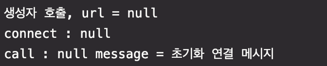

# [8] 스프링 핵심 원리 - 빈 생명주기 콜백

### 학습 목표

1. 빈 생명주기 콜백 시작에 대해 안다.
2. 빈 등록 초기화, 소멸 메서드를 지정하는 방법을 안다.

## 1. 빈 생명주기 콜백 시작

- 데이터베이스 커넥션 풀이나, 네트워크 소켓처럼 애플리케이션 시작 시점에 필요한 연결을 미리 해두고, 애플리케이션 종료 시점에 연결을 모두 종료하는 작업을 진행하려면, 객체의 초기화와 종료 작업이 필요하다.

> ####  Database Connection Pool
> -

#### 외부 네트워크에 미리 연결하는 객체를 생성하는 예제
```java
public class NetworkClient {
    private String url;

    public NetworkClient() {
        System.out.println("생성자 호출, url = " + url);
        connect();
        call("초기화 연결 메시지");
    }

    public void setUrl(String url) {
        this.url = url;
    }

    // 서비스 시작 시 호출
    public void connect() {
        System.out.println("connect : " + url);
    }

    public void call(String message) {
        System.out.println("call : " + url + " message = " + message);
    }

    // 서비스 종료 시 호출
    public void disconnect() {
        System.out.println("close : " + url);
    }
}
```
#### 스프링 빈 라이프사이클 테스트
```java
public class BeanLifeCycleTest {

    @Test
    public void lifeCycleTest() {
        ConfigurableApplicationContext ac = new AnnotationConfigApplicationContext(LifeCycleConfig.class);
        NetworkClient client = ac.getBean(NetworkClient.class);
        ac.close();
    }

    @Configuration
    static class LifeCycleConfig {

        @Bean
        public NetworkClient networkClient() {
            NetworkClient networkClient = new NetworkClient();
            networkClient.setUrl("http://hello-spring.dev");

            return networkClient;
        }
    }
}
```

- 생성자 부분을 보면 url 정보 없이 connect가 호출되고 있다
- 객체 생성 단계에는 url이 없고, 객체를 생성한 다음에 외부에서 setter 주입을 통해서 `setUrl()` 이 호출되어야 url이 존재하게 된다

### 스프링 빈의 라이프 사이클
- 객체 생성 ➡️ 의존 관계 주입
- 스프링 빈은 객체를 생성하고, 의존관계 주입이 다 끝난 다음에야 필요한 데이터를 사용할 수 있는 준비가 완료된다.
- 그래서, 초기화 작업은 의존관계 주입이 모두 완료되고 난 다음에 호출해야 한다
- 🧐 개발자가 어떻게 스프링 의존관계 주입이 완료되었는지 알까?
    - 그래서, 스프링은 의존관계 주입이 완료되면 스프링 빈에게 콜백 메서드를 통해서 초기화 시점을 알려주는 다양한 기능을 제공한다
    - 그리고, 스프링 컨테이너가 종료되기 직전에 소멸 콜백을 준다

#### 스프링 빈의 이벤트 라이프사이클
- **스프링 컨테이너 생성 ➡️ 스프링 빈 생성 ➡️ 의존관계 주입 ➡️ 초기화 콜백 ➡️ 사용 ➡️ 소멸 전 콜백 ➡️ 스프링 종료**
- 초기화 콜백 : 스프링 빈이 생성되고, 스프링 빈의 의존 관계 주입이 완료된 후에 호출
- 소멸전 콜백 : 스프링 빈이 소멸되기 직전에 호출

> #### 📌 참고
> - 객체의 생성과 초기화를 분리하자
> - 생성자는 필수 정보(파라미터)를 받고, 메모리를 할당해서 객체를 생성하는 책임을 가진다
> - 초기화는 생성된 값들을 활용해서 외부 커넥션을 연결하는 등의 무거운 동작을 수행한다
> - 그래서, 생성자 안에서 무거운 초기화 작업을 같이 하는 것 보다는, 객체를 생성하는 부분과 초기화 하는 부분을 명확하게 나누는 것이 좋다!

### 스프링이 지원하는 빈 생명주기 콜백
1. 인터페이스 InitializingBean, DisposableBean
2. 설정 정보에 초기화 메서드, 종료 메서드 지정
3. @PostConstuct, @PreDestroy


### 1. 인터페이스 InitializingBean, DisposableBean

```java
public class NetworkClient implements InitializingBean, DisposableBean {
      private String url;

      public NetworkClient() {
				System.out.println("생성자 호출, url = " + url); 	
			}

      public void setUrl(String url) {
          this.url = url;
			}

      //서비스 시작시 호출
      public void connect() {
                System.out.println("connect: " + url);
            }
            public void call(String message) {
                System.out.println("call: " + url + " message = " + message);
      }

      //서비스 종료시 호출
      public void disConnect() {
                System.out.println("close + " + url);
            }
            @Override
            public void afterPropertiesSet() throws Exception {
            	connect();
            	call();
            }

      @Override
      public void destroy() throws Exception{
      		disConnect();
      }
```

- 단점
  - 스프링 전용 인터페이스
  - 해당 코드가 인터페이스에 의존한다는 단점
  - 초기화, 소멸 메서드의 이름 변경 불가능
  - 외부 라이브러리에 적용 불가능

### 2. 빈 등록 초기화, 소멸 메서드 지정

```java
public class NetworkClient {
      private String url;
      public NetworkClient() {
        System.out.println("생성자 호출, url = " + url);
      }

  		public void setUrl(String url) {
          this.url = url;
			}
      //서비스 시작시 호출
      public void connect() {
                System.out.println("connect: " + url);
      }

  		public void call(String message) {
                System.out.println("call: " + url + " message = " + message);
      }
      //서비스 종료시 호출
      public void disConnect() {
                System.out.println("close + " + url);
      }
      public void init() {
         System.out.println("init ");
        connect();
        call();
      }

  		public void close() {
        System.out.println("NetworkClient.close");
        disConnect();
      }
```

- 메서드 이름을 자유롭게 줄 수 있음
- 스프링 빈이 아니라서 스프링 코드에 의존하지 않음


### 3. 애노테이션 @PostConstruct, @PreDestroy

```java
package hello.core.lifecycle;
  import javax.annotation.PostConstruct;
  import javax.annotation.PreDestroy;
  public class NetworkClient {
      private String url;
      public NetworkClient() {
System.out.println("생성자 호출, url = " + url); }
      public void setUrl(String url) {
          this.url = url;
      }

      public void connect() {
      		System.out.println("connect");
      }

  		public void call(String message) {
        System.out.println("call: " + url + " message = " + message);
      }
      //서비스 종료시 호출
      public void disConnect() {
              System.out.println("close + " + url);
          }
          @PostConstruct
          public void init() {
      System.out.println("NetworkClient.init"); connect();
      call("초기화 연결 메시지");
      }
          @PreDestroy
          public void close() {
              System.out.println("NetworkClient.close");
              disConnect();
          }
}
```

- 최신 스프링에서 가장 권장
- 애노테이션 하나만 붙이면 되서 매우 편리함
- 외부 라이브러리에는 적용하지 못함
  - 외부 라이브러리를 초기화, 종료해야 하면 @Bean의 기능을 사용해야 함
