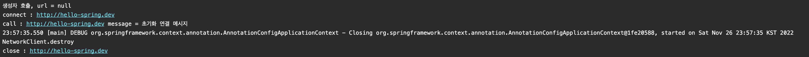
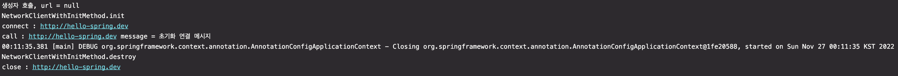
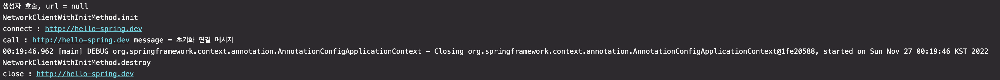

# [8] 스프링 핵심 원리 - 빈 생명주기 콜백

### 학습 목표

1. 빈 생명주기 콜백 시작에 대해 안다.
2. 빈 등록 초기화, 소멸 메서드를 지정하는 방법을 안다.

## 1. 빈 생명주기 콜백 시작

- 데이터베이스 커넥션 풀이나, 네트워크 소켓처럼 애플리케이션 시작 시점에 필요한 연결을 미리 해두고, 애플리케이션 종료 시점에 연결을 모두 종료하는 작업을 진행하려면, 객체의 초기화와 종료 작업이 필요하다.

> ####  Database Connection Pool
> -

#### 외부 네트워크에 미리 연결하는 객체를 생성하는 예제
```java
public class NetworkClient {
    private String url;

    public NetworkClient() {
        System.out.println("생성자 호출, url = " + url);
        connect();
        call("초기화 연결 메시지");
    }

    public void setUrl(String url) {
        this.url = url;
    }

    // 서비스 시작 시 호출
    public void connect() {
        System.out.println("connect : " + url);
    }

    public void call(String message) {
        System.out.println("call : " + url + " message = " + message);
    }

    // 서비스 종료 시 호출
    public void disconnect() {
        System.out.println("close : " + url);
    }
}
```
#### 스프링 빈 라이프사이클 테스트
```java
public class BeanLifeCycleTest {

    @Test
    public void lifeCycleTest() {
        ConfigurableApplicationContext ac = new AnnotationConfigApplicationContext(LifeCycleConfig.class);
        NetworkClient client = ac.getBean(NetworkClient.class);
        ac.close();
    }

    @Configuration
    static class LifeCycleConfig {

        @Bean
        public NetworkClient networkClient() {
            NetworkClient networkClient = new NetworkClient();
            networkClient.setUrl("http://hello-spring.dev");

            return networkClient;
        }
    }
}
```

- 생성자 부분을 보면 url 정보 없이 connect가 호출되고 있다
- 객체 생성 단계에는 url이 없고, 객체를 생성한 다음에 외부에서 setter 주입을 통해서 `setUrl()` 이 호출되어야 url이 존재하게 된다

### 스프링 빈의 라이프 사이클
- 객체 생성 ➡️ 의존 관계 주입
- 스프링 빈은 객체를 생성하고, 의존관계 주입이 다 끝난 다음에야 필요한 데이터를 사용할 수 있는 준비가 완료된다.
- 그래서, 초기화 작업은 의존관계 주입이 모두 완료되고 난 다음에 호출해야 한다
- 🧐 개발자가 어떻게 스프링 의존관계 주입이 완료되었는지 알까?
    - 그래서, 스프링은 의존관계 주입이 완료되면 스프링 빈에게 콜백 메서드를 통해서 초기화 시점을 알려주는 다양한 기능을 제공한다
    - 그리고, 스프링 컨테이너가 종료되기 직전에 소멸 콜백을 준다

#### 스프링 빈의 이벤트 라이프사이클
- **스프링 컨테이너 생성 ➡️ 스프링 빈 생성 ➡️ 의존관계 주입 ➡️ 초기화 콜백 ➡️ 사용 ➡️ 소멸 전 콜백 ➡️ 스프링 종료**
- 초기화 콜백 : 스프링 빈이 생성되고, 스프링 빈의 의존 관계 주입이 완료된 후에 호출
- 소멸전 콜백 : 스프링 빈이 소멸되기 직전에 호출

> #### 📌 참고
> - 객체의 생성과 초기화를 분리하자
> - 생성자는 필수 정보(파라미터)를 받고, 메모리를 할당해서 객체를 생성하는 책임을 가진다
> - 초기화는 생성된 값들을 활용해서 외부 커넥션을 연결하는 등의 무거운 동작을 수행한다
> - 그래서, 생성자 안에서 무거운 초기화 작업을 같이 하는 것 보다는, 객체를 생성하는 부분과 초기화 하는 부분을 명확하게 나누는 것이 좋다!

### 스프링이 지원하는 빈 생명주기 콜백
1. 인터페이스 InitializingBean, DisposableBean
2. 설정 정보에 초기화 메서드, 종료 메서드 지정
3. @PostConstuct, @PreDestroy 애노테이션 지원


## 2. 인터페이스 InitializingBean, DisposableBean

```java
public class NetworkClient implements InitializingBean, DisposableBean {
    private String url;

    public NetworkClient() {
        System.out.println("생성자 호출, url = " + url);
    }

    public void setUrl(String url) {
        this.url = url;
    }

    // 서비스 시작 시 호출
    public void connect() {
        System.out.println("connect : " + url);
    }

    public void call(String message) {
        System.out.println("call : " + url + " message = " + message);
    }

    // 서비스 종료 시 호출
    public void disconnect() {
        System.out.println("close : " + url);
    }

    @Override
    public void afterPropertiesSet() throws Exception {
        connect();
        call("초기화 연결 메시지");
    }

    @Override
    public void destroy() throws Exception {
        System.out.println("NetworkClient.destroy");
        disconnect();
    }
}
```

#### 특징
- `InitializingBean` : `afterPropertiesSet()` 메서드로 초기화를 지원한다
- `DisposableBean` : `destroy()` 메서드로 소멸을 지원한다
- 출력 결과를 보면, 초기화 메서드가 의존관계 주입 완료 후에 적절하게 호출되었다
- 스프링 컨테이너의 종료가 호출되자 소멸 메서드가 호출되었다

- 단점
  - 스프링 전용 인터페이스라서,해당 코드가 스프링 전용 인터페이스에 의존한다
  - 초기화, 소멸 메서드의 이름 변경이 불가능하다
  - 그래서, 개발자가 코드를 고칠 수 없는 외부 라이브러리에 적용 불가능하다
- 인터페이스를 사용하는 초기화, 종료 방법은 스프링 초창기에 나온 방법이라 지금은 거의 사용하지 않는다

## 3. 빈 등록 초기화, 소멸 메서드 지정
- 설정 정보에 `@Bean(initMethod = "init", destroyMethod = "close")` 를 입력하여 초기화, 소멸 메서드를 지정한다

```java
public void init() throws Exception {
    System.out.println("NetworkClientWithInitMethod.init");
    connect();
    call("초기화 연결 메시지");
}

public void close() throws Exception {
    System.out.println("NetworkClientWithInitMethod.destroy");
    disconnect();
}
```

```java
@Bean(initMethod = "init", destroyMethod = "close")
public NetworkClientWithInitMethod networkClientWithInitMethod() {
    NetworkClientWithInitMethod networkClient = new NetworkClientWithInitMethod();
    networkClient.setUrl("http://hello-spring.dev");

    return networkClient;
}
```

#### 특징
- 메서드 이름을 자유롭게 줄 수 있다
- 스프링 빈이 아니라서 스프링 코드에 의존하지 않다
- 코드가 아니라 설정 정보를 사용하기 때문에 코드를 고칠 수 없는 외부 라이브러리에도 초기화, 종료 메서드를 적용할 수 있다

#### 종료 메서드 추론
- `@Bean의 destroyMethod` 에는 아주 특별한 기능이 있다
```java
String destroyMethod() default AbstractBeanDefinition.INFER_METHOD;
```
- 추론으로 등록되어있어서, 추론 기능은 `close`, `shutdown` 라는 이름의 메서드를 자동으로 호출해준다
- 즉, 종료 메서드를 추론해서 호출해준다
- 만약, 추론 기능을 이용하고 싶지 않다고 하면, `destroyMethod=""` 로 지정하면 된다


## 4. 애노테이션 @PostConstruct, @PreDestroy
```java
@PostConstruct
public void init() throws Exception {
    System.out.println("NetworkClientWithInitMethod.init");
    connect();
    call("초기화 연결 메시지");
}

@PreDestroy
public void close() throws Exception {
    System.out.println("NetworkClientWithInitMethod.destroy");
    disconnect();
}
```

```java
@Bean
public NetworkClientWithAnnotation networkClientWithAnnotation() {
     NetworkClientWithAnnotation networkClient = new NetworkClientWithAnnotation();
     networkClient.setUrl("http://hello-spring.dev");

     return networkClient;
}
```

#### 특징
- 최신 스프링에서 가장 권장하는 방법이다
- 애노테이션 하나만 붙이면 되서 매우 편리하다
- `javax.annotation` -> 스프링에 종속적인 기술이 아닌, JSR-250 이라는 자바 표준!
  - 그래서 스프링이 아닌 다른 컨테이너에서도 동작한다
- 외부 라이브러리에는 적용하지 못한다!!!!!
  - 외부 라이브러리를 초기화, 종료해야 하면 @Bean의 기능을 사용해야 한다
