# [9] 스프링 핵심 원리 - 빈 스코프

### 학습 목표

1. 빈 스코프에 대해 안다.
2. 프로토타입 스코프와 싱글톤 빈과 함께 사용 시 Provider로 문제 해결
3. 스코프와 프록시에 대해 안다.


## 1. 빈 스코프란?
- 스프링 빈이 스프링 컨테이너의 시작과 함꼐 생성되어서 스프링 컨테이너가 종료될 때까지 유지된다고 학습했다.
- 왜냐면, 스프링 빈이 기본적으로 싱글톤 스코프로 생성되기 때문이다.
- 결국, 빈 스코프는 **빈이 존재할 수 있는 범위**를 의미한다.

### 스프링은 다음과 같은 다양한 스코프를 지원한다
- **싱글톤** : 기본 스코프로, 스프링 컨테이너의 시작과 컨테이너 종료까지 유지되는 가장 넓은 범위의 스코프
- **프로토타입** : 빈의 생성과 의존관계 주입까지만 관여하고 더는 관리하지 않는 매우 짧은 범위의 스코프
#### 웹 관련 스코프
- **request** : 웹 요청이 들어오고 나갈 때까지 유지되는 스코프
- **session** : 웹 세션이 생성되고 종료될 때까지 유지되는 스코프
- **application** : 웹의 서블릿 컨텍스트와 같은 범위 유지되는 스코프

#### 컴포넌트 스캔 자동 등록
```java
@Scope("prototype")
@Component
public class HelloBean {}
```

#### 수동 등록
```java
@Scope("prototype")
@Bean
PrototypeBean HelloBean() {
	return new HelloBean();
}
```
<br/>

## 2. 프로토타입 스코프
- 싱글톤 스코프의 빈을 조회하면, **스프링 컨테이너는 항상 같은 인스턴스의 스프링 빈을 반환한다**
- 반면에, 프로토타입 스코프를 스프링 컨테이너에 조회하면 스프링 컨테이너는 항상 새로운 인스턴스를 생성해서 반환한다.

### 싱글톤 빈 요청
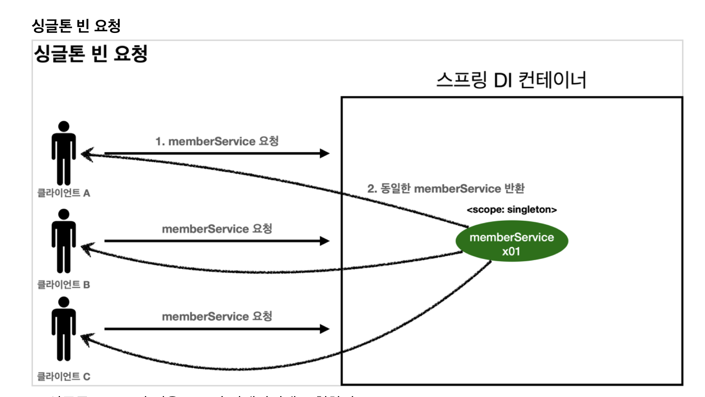
1. 싱글톤 스코프의 빈을 스프링 컨테이너에 요청한다.
2. 스프링 컨테이너는 본인이 관리하는 스프링 빈을 반환한다.
3. 이후에 스프링 컨테이너에 같은 요청이 와도 같은 객체 인스턴스의 스프링 빈을 반환한다.

### 프로토타입 빈 요청1
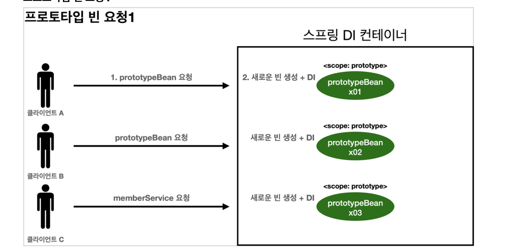
1. 프로토타입 스코프의 빈을 스프링 컨테이너에 요청한다.
2. 스프링 컨테이너는 요청 시점에 프로토타입 빈을 생성하고, 필요한 의존 관계를 주입한다

### 프로토타입 빈 요청2
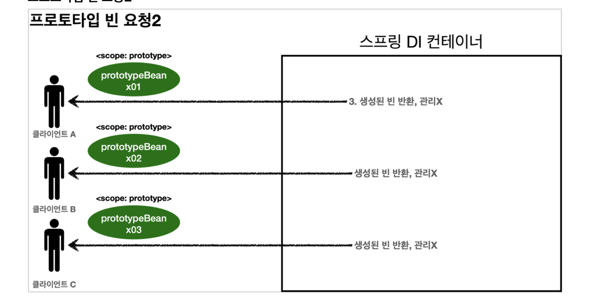
3. 스프링 컨테이너는 생성한 프로토타입 빈을 클라이언트에 반환한다.
4. 이후에 스프링 컨테이너에 같은 요청이 오면 항상 새로운 프로토타입 빈을 생성해서 반환한다.

### 정리
- **스프링 컨테이너는 프로토타입 빈을 생성하고, 의존 관계 주입, 초기화까지만** 처리한다
- 클라이언트에 빈을 반환하고 이후 스프링 컨테이너는 생성된 프로토타입 빈을 관리하지 않는
- 프로토타입 빈을 관리할 책임은 프로토타입 빈을 받은 클라이언트에 있다.
- 그래서, `@PreDestroy` 와 같은 종료 메서드가 호출되지 않는다.

#### SingletonBean Test
```java
public class SingletonTest {

    @Test
    void singletonBeanFind() {
        AnnotationConfigApplicationContext ac = new AnnotationConfigApplicationContext(SingletonBean.class);
        SingletonBean bean1 = ac.getBean(SingletonBean.class);
        SingletonBean bean2 = ac.getBean(SingletonBean.class);
        System.out.println("bean1 = " + bean1);
        System.out.println("bean2 = " + bean2);
        assertThat(bean1).isSameAs(bean2);
        ac.close();
    }

    @Scope("singleton")
    static class SingletonBean {

        @PostConstruct
        public void init() {
            System.out.println("SingletonBean.init");
        }

        @PreDestroy
        public void destroy() {
            System.out.println("SingletonBean.destroy");
        }
    }
}
```
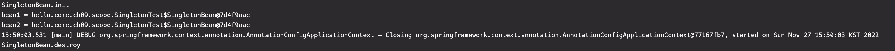
- 싱글톤 빈은 스프링 컨테이너 생성 시점에 초기화 메서드가 실행된다


```java
public class PrototypeTest {

    @Test
    void prototypeBeanFind() {
        AnnotationConfigApplicationContext ac = new AnnotationConfigApplicationContext(PrototypeBean.class);
        System.out.println("find prototypeBean1");
        PrototypeBean bean1 = ac.getBean(PrototypeBean.class);

        System.out.println("find prototypeBean2");
        PrototypeBean bean2 = ac.getBean(PrototypeBean.class);

        System.out.println("bean1 = " + bean1);
        System.out.println("bean2 = " + bean2);

        assertThat(bean1).isNotSameAs(bean2);
        //        bean1.destroy(); // 수동으로 직접 호출해야 한다
        ac.close();
    }

    @Scope("prototype")
    static class PrototypeBean {
        @PostConstruct
        public void init() {
            System.out.println("PrototypeBean.init");
        }

        @PreDestroy
        public void destroy() {
            System.out.println("PrototypeBean.destroy");
        }
    }

}
```
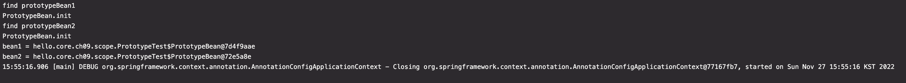
- 프로토타입 스코프의 빈은 스프링 컨테이너에서 빈을 조회할 때 생성되고, 그 때 초기화 메서드도 실행된다
- 프로토타입 빈을 2번 조회했으므로, 서로 다른 스프링 빈이 생성되고, 초기화도 2번 실행된다
- 싱글톤 빈은 스프링 컨테이너가 관리하기 때문에, 스프링 컨테이너가 종료될 때 빈의 종료 메서드가 실행되지만,
- 프로토타입 빈은 스프링 컨테이너가 생성과 의존관계 주입 & 초기화까지만 관여하고 더는 관리하지 않는다.
- 그래서, 프로토타입 빈은 스프링 컨테이너가 종료될 때 `@PreDestroy` 같은 종료 메서드가 전혀 실행되지 않는다

### 프로토타입 빈의 특징 정리
- 스프링 컨테이너에 요청할 때 마다 새로 생성된다
- 스프링 컨테이너는 프로토타입 빈의 생성과 의존관계 주입 그리고 초기화까지만 관여한다
- 종료 메서드가 호출되지 않는다

## 3. 프로토타입 스코프 - 싱글톤 빈과 함께 사용 시 문제점
- 스프링 컨테이너에 프로토타입 스코프의 빈을 요청하면 항상 새로운 객체 인스턴스를 생성해서 반환한다.
- 그러나, 싱글톤 빈과 함께 사용할 때는 의도한대로 잘 동작하지 않는다.

#### 스프링 컨테이너에 프로토타입 빈을 직접요청하는 예제
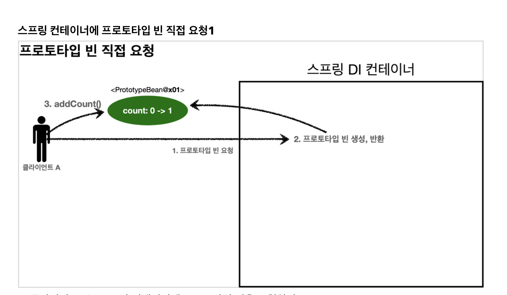
1. 클라이언트 A는 스프링 컨테이너에 프로토타입 빈을 요청한다
2. 스프링 컨테이너는 프로토타입 빈을 새로 생성해서 반환한다. 해당 빈의 count 필드 값은 `0`이다.
3. 클라이언트는 조회한 프로토타입 빈에 `addCount()` 를 호출하면서 count +1한다
4. 결과적으로 프로토타입 빈의 count는 `1`이 된다.

### 스프링 컨테이너에 프로토타입 빈 직접 요청2
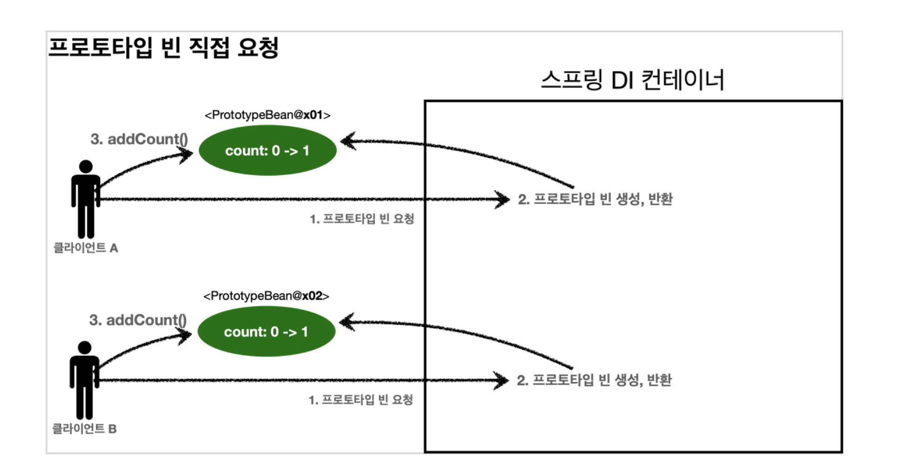
1. 클라이언트B는 스프링 컨테이너에 프로토타입 빈을 요청한다.
2. 스프링 컨테이너는 프로토타입 빈을 새로 생성해서 반환한다. 해당 빈의 count 필드 값은 `0`이다.
3. 클라이언트는 조회한 프로토타입 빈에 `addCount()` 를 호출하면서 count+1한다
4. 결과적으로 프로토타입 빈의  count는 `1`이 된다.

```java
public class SingletonWithPrototypeTest1 {

    @Test
    void prototypeFind() {
        AnnotationConfigApplicationContext ac = new AnnotationConfigApplicationContext(PrototypeBean.class);
        PrototypeBean prototypeBean1 = ac.getBean(PrototypeBean.class);
        prototypeBean1.addCount();
        assertThat(prototypeBean1.getCount()).isEqualTo(1);

        PrototypeBean prototypeBean2 = ac.getBean(PrototypeBean.class);
        prototypeBean2.addCount();
        assertThat(prototypeBean2.getCount()).isEqualTo(1);
    }

    @Scope("prototype")
    static class PrototypeBean {
        private int count = 0;

        public void addCount() {
            count++;
        }

        public int getCount() {
            return count;
        }

        @PostConstruct
        public void init() {
            System.out.println("PrototypeBean.init = " + this);
        }

        @PreDestroy
        public void destroy() {
            System.out.println("PrototypeBean.destroy");
        }
    }
}
```

### 싱글톤 빈에서 프로토타입 빈을 사용하는 경우
- `clientBean` 이라는 싱글톤 빈이 의존관계 주입을 통해서 프로토타입 빈을 주입받아서 사용하는 예제
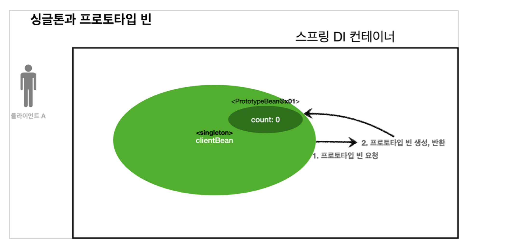
- `clientBean` 은 싱글톤이어서, 스프링 컨테이너 생성 시점에 함께 생성되고, 의존관계 주입도 발생한다
  - 1. `clientBean` 은 자동 의존관계 주입을 사용한다. 주입 시점에 스프링 컨테이너에 프로토타입 빈을 요청한다
  - 2. 스프링 컨테이너는 프로토타입 빈을 생성해서 `clientBean` 에 반환한다. 프로토타입 빈의 count 필드 값은 `0`이다.
- 이제 `clientBean`은 프로토타입 빈의 참조값을 내부 필드에 보관한다

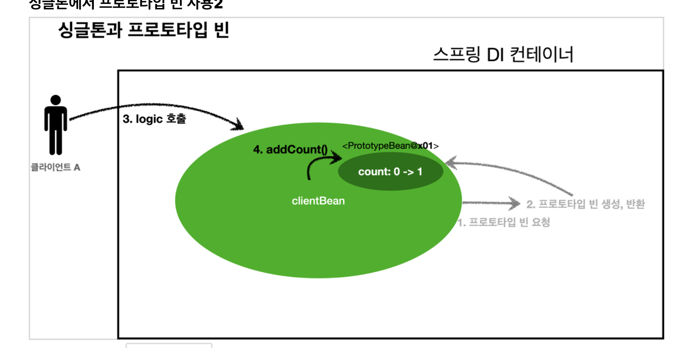
- 클라이언트 A는 `clientBean` 을 스프링 컨테이너에 요청해서 받는다
- 싱글톤이므로 항상 같은 `clientBean` 이 반환된다
  - 3. 클라이언트A는 `clientBean.logic()` 을 호출한다
  - 4. `clientBean` 은 prototypeBean의 `addCount()` 를 호출해서 프로토타입 빈의 count를 증가한다
  - count 값은 `1` 이 된다.

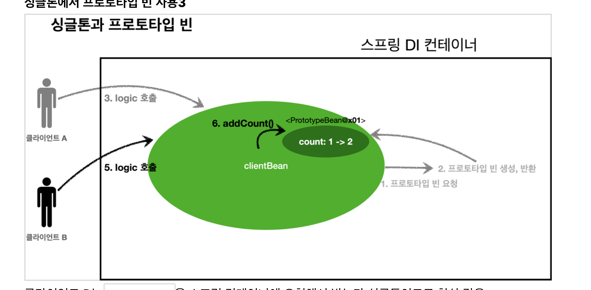
- 클라이언트 B는 `clientBean` 을 스프링 컨테이너에 요청해서 받는다
- 싱글톤이므로 항상 같은 `clientBean` 이 반환된다
- ⭐️ `clientBean`이 내부에 가지고 있는 프로토타입 빈은 이미 과거에 주입이 끝난 빈이다
  - ⭐️ 주입 시점에 스프링 컨테이너에 요청해서 프로토타입 빈이 새로 생성된 것이지, 사용할 때마다 새로 생성되는 것이 아니다!
  - 5. 클라이언트 B는 `clientBean.logic()` 을 호출한다
  - 6. `clientBean` 은  prototypeBean의 `addCount()` 를 호출해서 프로토타입 빈의 count를 증가한다.
  - 원래 count 값 1이었으므로, `2`가 된다

```java
@Test
void singletonClientUsePrototype() {
    AnnotationConfigApplicationContext ac = new AnnotationConfigApplicationContext(ClientBean.class, PrototypeBean.class);
    ClientBean clientBean1 = ac.getBean(ClientBean.class);
    int count1 = clientBean1.logic();
    assertThat(count1).isEqualTo(1);

    ClientBean clientBean2 = ac.getBean(ClientBean.class);
    int count2 = clientBean2.logic();
    assertThat(count2).isEqualTo(2);

}

@Scope("singleton")
static class ClientBean {
    private final PrototypeBean prototypeBean; // 생성시점에 주입

    @Autowired
    public ClientBean(PrototypeBean prototypeBean) {
        this.prototypeBean = prototypeBean;
    }

    public int logic() {
        prototypeBean.addCount();
        return prototypeBean.getCount();
    }
}
```
- 스프링은 일반적으로 싱글톤 빈을 사용하므로, 싱글톤 빈이 프로토타입 빈을 사용하게 된다
- 그런데, 싱글톤 빈은 생성 시점에만 의존관계 주입을 받기 때문에,
- 프로토타입 빈이 새로 생성되기는 하지만, 싱글톤 빈과 함께 계속 유지된다
- 원하던 결과가 아니다. 프로토타입 빈을 쓰려던 목적은 프로토타입 빈을 주입 시점에만 새로 생성하는 것이 아니라, 사용할 때 마다 새로 생성해서 사용하려고 한 것이었다
- 이걸 어떻게 해결할 수 있을까?

## 4. 프로토타입 스코프 - 싱글톤 빈과 함께 사용 시 Provider로 문제 해결
- 싱글톤 빈과 프로토타입 빈을 함께 사용할 때, 어떻게 하면 사용할 때 마다 항상 새로운 프로토타입 빈을 생성할 수 있을까?

### 1. 스프링 컨테이너에 새로 요청
- 싱글톤 빈이 프로토타입 빈을 사용할 때 마다 스프링 컨테이너에 새로 요청한다
```java
@Scope("singleton")
static class ClientBean{

  @Autowired
  private ApplicationContext ac;

  public int logic() {
    PrototypeBean prototypeBean = ac.getBean(PrototypeBean.class);
    prototypeBean.addCount();
    return prototypeBean.getCount();
  }
}
```
- `ac.getBean()` 을 통해서 항상 새로운 프로토타입 빈이 생성되는 것을 확인할 수 있다
- 의존관계를 외부에서 주입 (DI) 받는 것이 아니라 이렇게 직접 필요한 의존관계를 찾는 것을 `Dependency Lookup(DL)` 의존관계 조회(탐색) 이라고 한다
- 그런데, 이렇게 스프링 애플리케이션 컨텍스트 전체를 주입받게 되는 것은 스프링 컨테이너에 종속적인 코드가 되고, 단위 테스트 하기가 어려워진다
- 지금 필요한 기능은 지정한 프로토타입 빈을 컨테이너에 대신 찾아주는 (DL) 기능 정도만 제공하는 무언가이다!

### ObjectFactory, ObjectProvider
- `ObjectProvider` : 지정한 빈을 컨테이너에서 대신 찾아주는 DL 서비스를 제공하는 것

```java
@Scope("singleton")
static class ClientBean{

    @Autowired
    private ObjectProvider<PrototypeBean> prototypeBeanProvider;

    public int logic() {
        PrototypeBean prototypeBean = prototypeBeanProvider.getObject();
        prototypeBean.addCount();
        return prototypeBean.getCount();
    }
}
```
- `ObjectProvider` 의 `getObject()` 를 호출하면 내부에서는 스프링 컨테이너를 통해서 해당 빈을 찾아서 반환한다 (**DL**)
- 스프링이 제공하는 기능을 사용하지만, 기능이 단순해서 단위 테스트를 만들기는 훨씬 쉬워진다

### 특징
- `ObjectFactory` : 기능이 단순하다, 별도의 라이브러리가 필요없다, 스프링에 의존한다
- `ObjectProvider` : `ObjectFactory` 를 상속받아서 옵션, 스트림 처리 등 편의 기능이 많다, 별도의 라이브러리가 필요없다, 스프링에 의존한다

### javax.inject.Provider
```java
import javax.inject.Provider;

@Scope("singleton")
static class ClientBean{

    @Autowired
    private Provider<PrototypeBean> prototypeBeanProvider;

    public int logic() {
        PrototypeBean prototypeBean = prototypeBeanProvider.get();
        prototypeBean.addCount();
        return prototypeBean.getCount();
    }
}
```
- `provider`의 `get()` 을 호출하면 스프링 내부에서는 스프링 컨테이너를 통해 해당 빈을 찾아서 반환한다
- 자바 표준이고, 기능이 단순해서 단위테스트를 만들기도 훨씬 쉬워진다

### 정리
- 🧐 그러면 프로토타입 빈을 언제 사용할까?
  - 매번 사용할 때 마다 의존 관계 주입이 완료된 새로운 객체가 필요하면 사용하면 된다
  - 실무에서 웹을 개발해보면, 싱글톤 빈으로 대부분의 문제를 해결할 수 있기 때문에 프로토타입 빈을 직접적으로 사용하는 일은 매우 드물다.
  - `ObjectProvider` , `JSR330 Provider` 등은 프로토타입 뿐만 아니라 DL이 필요한 경우는 언제든지 사용할 수 있다


## 5. 웹 스코프
- 지금까지 싱글톤과 프로토타입 스코프를 학습했는데,
- 싱글톤은 스프링 컨테이너의 시작과 끝까지 함께하는 매우 긴 스코프이고,
- 프로토타입은 생성과 의존관계 주입, 그리고 초기화까지만 진행하는 특별한 스코프이다

### 웹 스코프의 특징
- 웹 스코프는 웹 환경에서만 동작한다
- 웹 스코프는 프로토타입과 다르게 스프링이 해당 스코프의 종료시점까지 관리한다
- 그래서, 종료 메서드가 호출된다

### 웹 스코프 종류
1. **request** : **HTTP 요청 하나**가 들어오고 나갈 때 까지 유지되는 스코프, 각각의 HTTP 요청마다 별도의 빈 인스턴스가 생성되고, 관리됨
2. **session** : HTTP Session과 동일한 생명주기를 가지는 스코프
3. **application** : 서블릿 컨텍스트 (ServletContext)와 동일한 생명주기를 가지는 스코프
4. **websocket** : 웹 소켓과 동일한 생명주기를 가지는 스코프

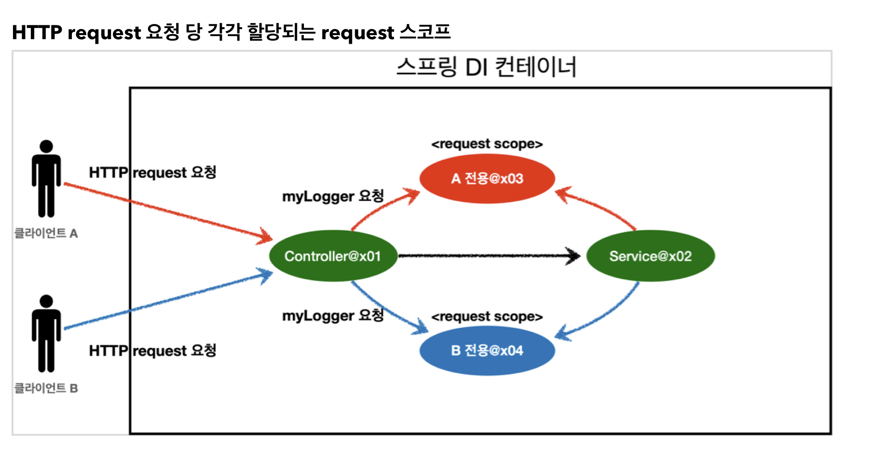
- 클라이언트 A와 클라이언트 B의 request 요청에 맞게 각각 request scope가 할당된다

## 6. Request Scope
- HTTP 요청 하나가 들어오고 나갈 때 까지 유지
- 프로토타입 빈은 요청할 때 마 계속 다른 빈 인스턴스를 생성하는데, Request 스코프는 HTTP 요청이 들어와서 나갈 때 까지는 같은 인스턴스이다 (응답이 나가면 destroy)

> 참고
> - `spring-boot-starter-web` 라이브러리를 추가하면 스프링 부트는 내장 톰캣 서버를 활용해서 웹 서버와 스프링을 함께 실행시킨다
> - 스프링부트는 웹 라이브러리가 없으면 `AnnotationConfigApplicationContext` 을 기반으로 애플리케이션을 구동하는데, 웹 라이브러리가 추가되면 웹과 관련된 추가 설정과 환경들이 필요하므로 `AnnotationConfigServletWebServerApplicationContext` 를 기반으로 애플리케이션을 구동한다

### Request Scope 예제
- UUID를 사용해서 HTTP 요청을 구분해보자
```java
@Component
@Scope(value = "request")
public class MyLogger {

    private String uuid;
    private String requestURL;

    public void setRequestURL(String requestURL) {
        this.requestURL = requestURL;
    }

    public void log(String message) {
        System.out.println("[" + uuid + "][" + requestURL + "][  " + message);
    }

    @PostConstruct
    public void init() {
        uuid = UUID.randomUUID().toString(); // UUID 생성해서 저장, 이 빈은 HTTP 요청 당 하나씩 생성되므로, uuid를 저장해두면 다른 HTTP 요청과 구분 가능
        System.out.println("[" + uuid + "] request scope bean create : " + this);
    }

    @PreDestroy
    public void close() {
        System.out.println("[" + uuid + "] request scope bean destroy : " + this);
    }
}
```
- 로그를 출력하기 위한 클래스로, `@Scope(value = "request")` 를 사용해서 request 스코프로 지정했다
- 이제 이 빈은 HTTP 요청 당 하나씩 생성되고, HTTP 요청이 끝나는 시점에 소멸된다
- 이 빈이 생성되는 시점에 `@PostConstruct` 초기화 메서드를 사용해서 uuid를 생성해서 저장해둔다
- 빈이 소멸되는 시점에 `@PreDestroy`를 사용해서 종료 메시지를 남긴다
- `requestURL` 은 이 빈이 생성되는 시점에는 알 수 없으므로, 외부에서 setter로 입력받는다

```java
@Controller
@RequiredArgsConstructor
public class LogDemoController {

    private final LogDemoService logDemoService;
    private final MyLogger myLogger;

    @RequestMapping("log-demo")
    @ResponseBody
    public String logDemo(HttpServletRequest request) {
        String requestURL = request.getRequestURL().toString();
        myLogger.setRequestURL(requestURL);

        myLogger.log("controller test");
        logDemoService.logic("testId");
        return "OK";
    }
}
```
- 로거가 잘 동작하는지 확인하는 컨트롤러
- `HttpServletRequest` 를 통해서 요청 URL을 받는다
- 받은 requestURL을 myLogger에 저장해둔다. `myLogger` 는 HTTP 요청 당 각각 구분되므로 다른 HTTP 요청 때문에 값이 섞이는 걱정은 하지 않아도 된다

```java
@Service
@RequiredArgsConstructor
public class LogDemoService {

    private final MyLogger myLogger;
    public void logic(String id) {
        myLogger.log("service id = " + id);
    }
}
```

### 가짜 프록시 객체는 요청이 오면 그 때 내부에서 진짜 빈을 요청하는 위임 로직이 들어있음


#### 동작 정리

- CGLIB라는 라이브러리로 내 클래스를 상속 받은 가짜 프록시 객체를 만들어서 주입함
- 이 가짜 프록시 객체는 실제 요청이 오면 내부에서 실제 빈을 요청하는 위임 로직이 들어있음
- 가짜 프록시 객체는 실제 request scope와는 관계가 없음


#### 특징 정리

- 프록시 객체 덕분에 클라이언트는 마치 싱글톤 빈을 사용하듯이 편리하게 request scope를 사용할 수 있음
- 꼭 웹 스코프가 아니어도 프록시 사용 가능

#### 주의점

- 마치 싱글톤을 사용하는 것 같지만, 다르게 동작하기에 주의해서 사용해야함 !!!
- 특별한 scope는 꼭 필요한 곳에서만 최소화해서 사용하도록 하자!!!


## 출처

[인프런 - 스프링 핵심원리 - 기본편](https://www.inflearn.com/course/%EC%8A%A4%ED%94%84%EB%A7%81-%ED%95%B5%EC%8B%AC-%EC%9B%90%EB%A6%AC-%EA%B8%B0%EB%B3%B8%ED%8E%B8)
